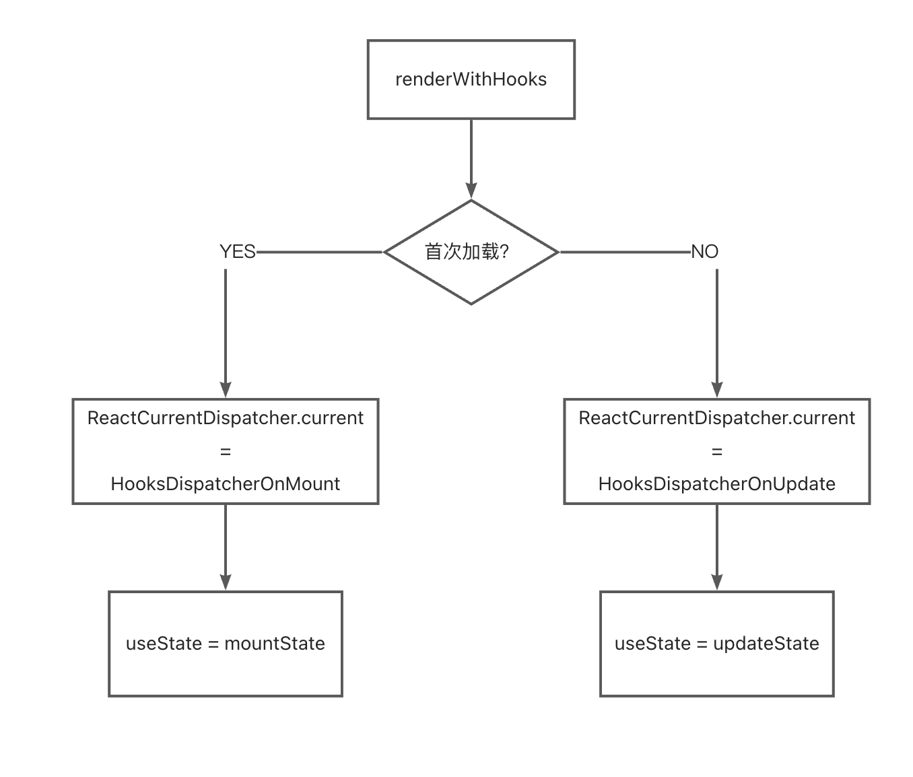

# React源码之Hooks实现原理

## 1.前言

关于react源码的分析和分享始于React-Hooks，在开始正式分享前，我们首先思考一下React团队**为什么**会发明React-Hooks？谈谈我的个人理解：

- CC中**复用**一些行为会很困难，react中我们要复用组件很容易，但是要是向要复用比组件更小粒度的行为，比较困难。虽然render-props，高阶组件等会一定程度上可以解决，但是层层嵌套会形成”嵌套地狱“。
- 复杂组件**可读性差**。有时一个逻辑紧凑的操作，不得不放在不同的生命周期函数中，需要相互关联和对照的代码被迫拆分。而不相关的代码却被放在一起（如放在同一个生命周期函数中），不利于逻辑上的理解。
- 相较于CC，FC更**容易上手**，学习成本低于CC

**但并不是说FC就一定比CC好，FC复用性更高业务逻辑复杂时可读性更高，CC组件拥有丰富的生命周期钩子，请具体业务具体分析！**


## 2.主体

### 2.1 说明

作为React源码之Hooks的开篇之作，为了更好的串联起整个React-Hooks，我将从以下几个方面展开：

（1）React-Hooks中的数据结构；（2）调用hook函数的整个流程；（3）最后通过一个例子具体说明Hook的整个流程

### 2.2 Hooks中的数据结构

#### 2.2.1 Hook

> 每一个hook方法都会生成一个特定类型的hook对象，用以存储信息，众多hooks对象会连接形成链表，挂载到fiber的memoizedState字段上

```js
export type Hook = {
  //1   上一次渲染用的state，不同的hook中memoizedState的含义不同
  //1   如在useState中：const[count,useCount] = useState(0)，memoizedState保存的就是state的值
  memoizedState: any, // 上一次渲染用的state
  baseState: any, // update计算出的state
  baseQueue: Update<any, any> | null, // 未处理完的update队列
  queue: any, // 当前update队列
  next: Hook | null, // 指向下一个hook，形成链表结构
};
```

比如我们调用两个useState

```js
const[count,useCount] = useState(0) ;
const[num,useNum] = useState(1)
```

那么其hook链表的数据结构如下所示：

```js
{
  memoizedState: 0,
  baseState: 0,
  baseQueue: null,
  queue: null,
  next: {
      memoizedState: 1,
      baseState: 1,
      baseQueue: null,
      queue: null,
}
```

**⚠️注意：对于不同的hook函数在memoizedState中存放的数据也是不一样的，通过官网以及 React Devtools 工具上能感知到：**

- useState 存放的是 State
- useEffect 存放的是一个 effect 对象，在 devtools 上表现出来就是一个 fn
- useRef 存放的就是一个包含 current 的对象
- useMemo 存放的就是它的回调和依赖项数组

#### 2.2.2 Update & UpdateQueue

Update 和 UpdateQueue 是存储 `useState` 的 state 及 `useReducer` 的 reducer 相关内容的数据结构。

```js
// packages/react-reconciler/src/ReactFiberHooks.old.js

type Update<S, A> = {|
  lane: Lane, // 优先级
  // reducer 对应要执行的 action
  action: A,
  // 触发 dispatch 时的 reducer
  eagerReducer: ((S, A) => S) | null,
  // 触发 dispatch 是的 state
  eagerState: S | null,
  // 下一个要执行的 Update
  next: Update<S, A>,
  // react 的优先级权重
  priority?: ReactPriorityLevel,
|};

type UpdateQueue<S, A> = {|
  // 当前要触发的 update
  pending: Update<S, A> | null,
  // 存放 dispatchAction.bind() 的值
  dispatch: (A => mixed) | null,
  // 上一次 render 的 reducer
  lastRenderedReducer: ((S, A) => S) | null,
  // 上一次 render 的 state
  lastRenderedState: S | null,
|};
```

每次调用 `useState` 或者 `useReducer` 的 dispatch 时，都会生成一个 Update 类型的对象，并将其添加到 UpdateQueue 队列中。

最后 react 会遍历 `UpdateQueue` 中的每个 Update 去进行更新。

#### 2.2.3 Effect

Effect 结构是和 `useEffect` 等 effect hooks 相关的，先看一下它的结构：

```js
// packages/react-reconciler/src/ReactFiberHooks.old.js

export type Effect = {|
  tag: HookFlags, // 标记是否有 effect 需要执行
  create: () => (() => void) | void, // 回调函数
  destroy: (() => void) | void, // 销毁时触发的回调
  deps: Array<mixed> | null, // 依赖的数组
  next: Effect, // 下一个要执行的 Effect
|};
```

当我们的函数组件中使用了如下的 `useEffect` 时：

```js
useEffect(() => {
  console.log('create');
  return () => {
    console.log('destroy');
  };
}, []);
```

对应的 Hook 如下：

```js
{
  memoizedState: {
    create: () => { console.log('create') },
    destroy: () => { console.log('destroy') },
    deps: [],
    // ...
  },
  baseState: null,
  baseQueue: null,
  queue: null,
  next: null,
}
```

**这就是和 Hook 这部分强相关的三个对象**

### 2.4 调用hook函数的整个流程

在`react-main/packages/react/src/ReactHooks`中暴露了所有的hooks函数

```js
// 截取部分
export function useState<S>(
  initialState: (() => S) | S
): [S, Dispatch<BasicStateAction<S>>] {
  const dispatcher = resolveDispatcher();
  return dispatcher.useState(initialState);
}

export function useReducer<S, I, A>(
  reducer: (S, A) => S,
  initialArg: I,
  init?: (I) => S
): [S, Dispatch<A>] {
  const dispatcher = resolveDispatcher();
  return dispatcher.useReducer(reducer, initialArg, init);
}
```

观察每个 `hook` 函数，不难发现每个 `hook` 函数都调用了 `resolveDispatcher()` 函数，这个函数返回的是 `ReactCurrentDispatcher.current` ，全局搜索可以发现在 `renderWithHooks` 中会对其进行操作

```js
// react-main/packages/react-reconciler/ReactFiberHooks.js
export function renderWithHooks<Props, SecondArg>(
  current: Fiber | null,
  workInProgress: Fiber,
  Component: (p: Props, arg: SecondArg) => any,
  props: Props,
  secondArg: SecondArg,
  nextRenderLanes: Lanes
): any {
  …………
  if (__DEV__) {
    if (current !== null && current.memoizedState !== null) {
      ReactCurrentDispatcher.current = HooksDispatcherOnUpdateInDEV;
    } else if (hookTypesDev !== null) {
      ReactCurrentDispatcher.current = HooksDispatcherOnMountWithHookTypesInDEV;
    } else {
      ReactCurrentDispatcher.current = HooksDispatcherOnMountInDEV;
    }
  } else {
    // 根据不同状态 挂载不同的dispatcher到ReactCurrentDispatcher.current
    ReactCurrentDispatcher.current =
      current === null || current.memoizedState === null
        ? HooksDispatcherOnMount // 组件挂载时hook的初始化
        : HooksDispatcherOnUpdate; // 组件更新时hook的初始化
  }
  const shouldDoubleRenderDEV =
    __DEV__ &&
    debugRenderPhaseSideEffectsForStrictMode &&
    (workInProgress.mode & StrictLegacyMode) !== NoMode;

  shouldDoubleInvokeUserFnsInHooksDEV = shouldDoubleRenderDEV;
  let children = Component(props, secondArg);
  shouldDoubleInvokeUserFnsInHooksDEV = false;
  // 检查在render阶段是否更新
    if (didScheduleRenderPhaseUpdateDuringThisPass) {
      //  ReactFiberHooks中的renderWithHooksAgain()
    let numberOfReRenders: number = 0;
    do {
      ...
      ReactCurrentDispatcher.current = __DEV__
       //  开发环境
        ? HooksDispatcherOnRerenderInDEV
        : HooksDispatcherOnRerender;
      children = Component(props, secondArg);
    } while (didScheduleRenderPhaseUpdateDuringThisPass);
  }
  // 错误捕获处理
  ReactCurrentDispatcher.current = ContextOnlyDispatcher;
 ...
  return children;
}
```

**（1）通过上述代码总结Hooks 对象在 React 中存在的 4 种形态：**

-  在组件挂载时，将 ReactCurrentDispatcher.current 赋值为 HooksDispatcherOnMount ,这时候 hooks 的作用就是建立 Fiber 和 hooks 的桥梁，初次建立 Fiber 和 Hooks 的关系。
-  在组件更新时，将 ReactCurrentDispatcher.current 赋值为 HooksDispatcherOnUpdate，这个形态hooks 需要去获取更新维护状态。
- 在 render 阶段，将 ReactCurrentDispatcher.current 赋值为 HooksDispatcherOnRerender
- 在函数组件外部调用 hooks 时，也就是报错形态，将 ReactCurrentDispatcher.current 赋值为 ContextOnlyDispatcher，react 会抛出异常

**（2）通过上述代码总结renderWithHooks 函数的主要工作如下：**

- 首先会存一些数据，memoizedState 用来存放 hooks 的信息，updateQueue 存放副作用链表，在 commit 阶段去执行副作用
- 判断组件是 update 还是 mount 流程，给 ReactCurrentDispatcher.current 赋不一样的值
- 在执行 FC 之前，会将 current 赋值为 HooksDispatcherOnRerender,
- 调用 Component(props, secondArg) 真正的执行函数组件，依次执行每个 hooks
- 在函数组件执行完，将 current 赋值为 ContextOnlyDispatcher

#### 2.4.1 四种状态的hooks对象：

```js
// 函数组件初始化用的 hooks
const HooksDispatcherOnMount = { 
    useState: mountState,
    useEffect: mountEffect,
    ...
}
// 函数组件更新用的 hooks
const  HooksDispatcherOnUpdate ={
   useState:updateState,
   useEffect: updateEffect,
   ...
}
// 组件render阶段赋值ReactCurrentDispatcher.current 的对象
const HooksDispatcherOnRerender: Dispatcher = {
  useCallback: updateCallback,
  useContext: readContext,
  ...
};
// 当hooks不是函数内部调用的时候，调用这个hooks对象下的hooks，所以报错
const ContextOnlyDispatcher = {
   useEffect: throwInvalidHookError,
   useState: throwInvalidHookError,
   ...
}
```

**如此就完成了一整个调用hook函数的流程**

### 2.5 一个示例

我们通过最常用的一个hook-useState来讲解hook的执行流程

若current为空，则说明是**首次加载**，`ReactCurrentDispatcher.current` 将被赋值成 `mountState`

```js
// packages/react-reconciler/src/ReactFiberHooks.new.js
const HooksDispatcherOnMount: Dispatcher = {
  // ...
  useState: mountState,
  // ...
};
```

若current不为空，说明是在组件**更新阶段**，`ReactCurrentDispatcher.current` 将被赋值成 `updateState`

```js
// packages/react-reconciler/src/ReactFiberHooks.new.js

const HooksDispatcherOnUpdate: Dispatcher = {
  // ...
  useState: updateState,
  // ...
};
```

所以，调用hook函数的整个流程可以如下图所示：



## 3.总结

本文介绍了hook的背景，三种强相关的数据结构以及hook函数调用的整个过程，最后通过一个示例具体说明。不难发现：**当我们调用某个 `hook` 时，实际上调用的是挂载在 `ReactCurrentDispatcher.current` 属性上的对应的 hook 处理函数，一共四种形态每种形态都对应着不同的 dispatch 方法**

## 4.尾记

下面将开启React-Hooks系列的源码讲究，默认对各个hook都有了基本的了解！
