# React源码之useEffect

## 1.前言

本文将从useEffect，再到useEffect API的实现原理，再到 `useEffect` 的源码实现，最后会从 render 阶段到 commit 阶段介绍 useEffect 是如何被调度的

## 2.useEffect

```markdown
# useEffect【异步阻塞】函数会在浏览器完成布局与绘制之后执行
```

```js
React.useEffect(() => { 
  fn()
  return () => { 
    xxxxx
  }
}, []) 
// 如果什么都不写就是监视所有人，相当于componentDidMount+componentDidUpdate
// 如果指定的是[], 回调函数只会在第一次render()后执行，相当于componentDidMount
```

`useEffect` 是一个接受两个参数的函数。传递给 `useEffect` 的参数

- 第一个参数是一个名为 `effect` 的函数
- 第二个参数（是可选的）是一个存储依赖关系的数组

**重要的，如果第二个参数什么都不写就是监视所有人，相当于componentDidMount+componentDidUpdate；如果指定的是[], 回调函数只会在第一次render()后执行，相当于componentDidMount**

此时effect函数会在`componentDidUpdate` 的时候被调用，这个函数的返回值也可以是一个函数，这个返回的函数会在组件卸载的时候调用。

**小tips📓**：若想在DOM变更后浏览器执行绘制前执行，可以使用[useLayoutEffect](React全家桶/React源码解读/React源码之useLayoutEffect.md)【同步阻塞】

## 3.调度过程

对于 `useEffect` 来说，React 做的事情就是:

在 render 阶段，函数组件开始渲染，在 beginWork 阶段，会对特定类型的 component 进行差异化处理，对于 FC 会进入 `updateComponent` 的逻辑，会调用 `renderWithHooks` 方法来处理 `hooks` ，初始化时会创建 hook 链表挂载到 `workInProgress` 的 `memoizedState` 上，并创建 effect 链表，这个链表会根据依赖项有差异。

**如果依赖项没有变化的话， effect 时不会被处理的，也就不会存在于链表中**

在 `commit` 阶段的 `before Mutation` 阶段，会发起 `useEffect` 的异步调度，但是不会直接处理 `effect`，而是要等到 `commit` 阶段完成，更新已经处理完，才会开始处理 `useEffect` 产生的 `effect` 副作用

从整体上看，`useEffect` 的整个过程涉及到了 `render` 阶段和 `commit` 阶段两部分，render 阶段负责创建 `effect` 链表，`commit` 阶段去处理

这就是 `useEffect` 比较完整的调度流程，下面看以下 `useEffect` 的具体实现

## 4.mountEffect

在组件的 `mount` 阶段，执行 `useEffect` 实际上执行的是 `mountEffect`

```js
function mountEffect(
  create: () => (() => void) | void, // 回调函数
  deps: Array<mixed> | void | null, // 依赖项数组
): void {
  if (
    __DEV__ &&
    enableStrictEffects &&
    (currentlyRenderingFiber.mode & StrictEffectsMode) !== NoMode
  ) {
    return mountEffectImpl(
      MountPassiveDevEffect | PassiveEffect | PassiveStaticEffect,
      HookPassive, // 标识 hook 为 useEffect
      create, // 第一个参数,回调函数
      deps, // 第二个参数，依赖项数组
    );
  } else {
    return mountEffectImpl(
      PassiveEffect | PassiveStaticEffect,
      HookPassive,
      create,
      deps,
    );
  }
}
```

可以看到 `mountEffect` 接受 `useEffect` 用户传入的 `create` 回调函数，以及依赖项数组 `deps`，返回的是 `mountEffectImpl` 的执行结果

同时传入了用于位运算的 Fiber 节点标识，和 hook 对象的标识，以及两个传参

具体再看看 `mountEffectImpl` 的实现

### 4.1 mountEffectImpl

```js
function mountEffectImpl(fiberFlags, hookFlags, create, deps): void {
  // 创建 hook
  const hook = mountWorkInProgressHook();
  // 获取依赖
  const nextDeps = deps === undefined ? null : deps;
  currentlyRenderingFiber.flags |= fiberFlags;
  // 创建effect链表，挂载到hook的memoizedState上和fiber的updateQueue
  hook.memoizedState = pushEffect( //初始化effect链表
    HookHasEffect | hookFlags,
    create,
    undefined,
    nextDeps,
  );
}
```

- 首先会调用 `mountWorkInProgressHook`，将当前的 hook 添加到 `workProgressHook` 单向链表中，返回新的 hook 链表
- 接着初始化 `useEffect` 的第二个参数，也就是依赖项数组，可以看到，当我们不传的时候会被设为 null
- 接着将标识 Fiber 节点的 二进制值添加到 Fiber 的 `flags` 属性上
- 最后用 `pushEffect` 初始化 effect 链表，并挂到 `memoizedState` 上

### 4.2 pushEffect

```js
function pushEffect(tag, create, destroy, deps) {
   // 新建 effect 对象
  const effect: Effect = {
    tag, // useEffect 还是 useLayoutEffect
    create, // 回调
    destroy,
    deps, // 依赖
    // Circular
    next: (null: any),
  };
  // 从当前 Fiber 节点的 updateQueue  上获取当前 Fiber 的更新队列
  let componentUpdateQueue: null | FunctionComponentUpdateQueue = (currentlyRenderingFiber.updateQueue: any);
  if (componentUpdateQueue === null) {
    // 如果还没有，那就创建一个，将 effect 链表添加到队列上
    componentUpdateQueue = createFunctionComponentUpdateQueue();
    currentlyRenderingFiber.updateQueue = (componentUpdateQueue: any);
    componentUpdateQueue.lastEffect = effect.next = effect;
  } else {
    // 如果已经有更新队列，那就把 effect 加到 effect 链表的末尾，形成环状链表
    const lastEffect = componentUpdateQueue.lastEffect;
    if (lastEffect === null) {
      componentUpdateQueue.lastEffect = effect.next = effect;
    } else {
      const firstEffect = lastEffect.next;
      lastEffect.next = effect;
      effect.next = firstEffect;
      componentUpdateQueue.lastEffect = effect;
    }
  }
  // 返回 effect 链表
  return effect;
}
```

首先，会根据传入的参数，创建一个 effect 对象，该对象上存储着，useEffect 的两个参数：create 和 deps， 还有标识 hook 对象的 二进制数值 tag,还有一个 next 指针，形成 effect 链表

> 这里用二进制也是为了在运算中更快一些，不用二进制也行

接着就是将 `effect` 添加到 `effect` 链表中，需要先判断 `effect` 链表存不存在，存在就和 `next` 指针相连，形成环状链表。

最后返回的是 `effect` 给 `mountEffectImpl`，赋值给 `memoizedState` 属性

这就是在 `mount` 时,`useEffect` 创建 `effect` 的全部工作

### 4.3 mountEffect 小结

总结以下：

1. 在 `mountEffect` 中会调用 `mountEffectImpl` 去初始化创建 `effect` 链表
2. 在mountEffectImpl中会干 4 件事
   - 创建 hook 对象
   - 初始化依赖项
   - 设置 `flags`
   - 初始化 effect 链表
3. 初始化 effect 链表的逻辑在 `pushEffect` 中，会创建 effect 对象，并维护 `UpdateQueue` 上的 effect 环状链表
4. 在渲染完成后会，会循环这个环状链表，执行每个对象的 destroy 和 create

## 5.updateEffect

在页面更新时，会执行 `updateEffect`，调用 `updateEffectImpl` 完成 `effect` 链表的构建，这个过程会根据前后依赖的是否变化，来创建不同的 effect 对象，

- 首先会根据 `hook` 单向链表获取对应的更新时的 hook 对象，创建新的 hook 对象，加入 hook 的单向链表

- 如果拿到effect的deps不为 null，或者 undefined，会从当前 hook 对象拿到上一次effect对象，再从effect对象拿到deps和destroy

  ，用新的deps与之比较

  - 如果新老 `deps` 相等，push 一个不带 `HookHasEffect` 的 tag 给 effect 对象，加入 `updateQueue` 环状链表(没有副作用），不更新 `hook.memoizedState`
  - 如果新老 `deps` 不相等，更新 `effect` 对象，在 `effect` 的 tag 中加入 `HookHasEffect` 和上一次 `create` 执行的 `destroy`，更新 `hook.memoizedState`

```js
function updateEffectImpl(fiberFlags, hookFlags, create, deps): void {
  // 获取 更新时的 hook 对象
  const hook = updateWorkInProgressHook();
  const nextDeps = deps === undefined ? null : deps;
  let destroy = undefined;

  if (currentHook !== null) {
    // 从 currentHook 获取上一次的 effect
    const prevEffect = currentHook.memoizedState;
    destroy = prevEffect.destroy;
    if (nextDeps !== null) {
      const prevDeps = prevEffect.deps;
      // 比较前后的 deps 是否相等，push 一个不带 hasEffect 的 effect
      if (areHookInputsEqual(nextDeps, prevDeps)) {
        hook.memoizedState = pushEffect(hookFlags, create, destroy, nextDeps);
        return;
      }
    }
  }
  // 如果 deps 有变化，那就 push 一个 有 hookHasEffect 的 effect，并挂到 hook.memoizedState 上
  currentlyRenderingFiber.flags |= fiberFlags;

  hook.memoizedState = pushEffect(
    HookHasEffect | hookFlags,
    create,
    destroy,
    nextDeps,
  );
}
```

和 `mountEffectImpl` 有一些不同，在挂载时调用的 `pushEffect` 去创建 `effect` 对象，并没有传递 `destroy` 方法，而 `update` 的时候传了， 这是因为 `effect` 执行之前，都会先执行前一次的销毁函数，再执行新 `effect` 的创建函数，而 `mount` 时，并没有上一个 `effect` ，因此无需先销毁

再来看看这个 `areHookInputsEqual` 方法

### 5.1 areHookInputsEqual 比较

这个方法是用来比较两个 `deps` 是否相等的

```js
function areHookInputsEqual(
  nextDeps: Array<mixed>,
  prevDeps: Array<mixed> | null,
) {
  if (prevDeps === null) {
    return false;
  }
  // 循环遍历
  for (let i = 0; i < prevDeps.length && i < nextDeps.length; i++) {
    // is 比较函数是浅比较
    if (is(nextDeps[i], prevDeps[i])) {
      continue;
    }
    return false;
  }
  return true;
}
```

首先会遍历 `deps` ，调用 `is` 方法来比较依赖项数组中的每个依赖，`is` 方法是一个浅比较的方法

## 6.如何调度

由于 `useEffect` 回调延迟调用的设计，在实现上利用 `Scheduler` 的异步调度函数：`scheduleCallback`，将执行 `useEffect` 回调的动作作为一个任务去调度，这个任务会异步调用。

> 与 componentDidMount、componentDidUpdate 不同的是，在浏览器完成布局与绘制之后，传给 useEffect 的函数会延迟调用。 这使得它适用于许多常见的副作用场景，比如设置订阅和事件处理等情况，因此不应在函数中执行阻塞浏览器更新屏幕的操作。

和 `useEffect` 调度相关的部分在 React 的 commit 阶段

主要分为 `beforeMutation` 、`mutation`、`layout` 三个阶段

## 7.总结

整体流程如下所示：




至此useContext源码解析结束🔚！
