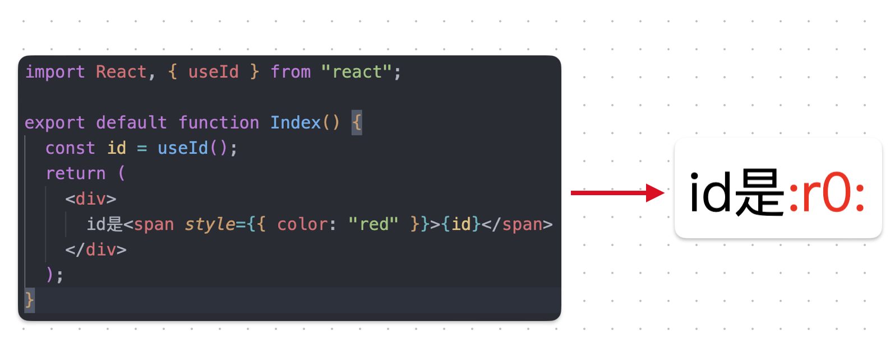

# React源码之useId

## 0.知识储备

- **`SSR`:** **传统的渲染方式，由服务端把渲染的完整的页面吐给客户端。这样减少了一次客户端到服务端的一次 HTTP 请求，加快响应速度。一般用于首屏的优化。**
- **`CSR`:** **目前流行的渲染方式，它依赖的是运行在客户端的 JS，用户首次发送请求只能的到小部分的指引性的 HTMLdiamante。第二次请求将会请求更多包含 HTML 字符串的 JS 文件。**
- **`Hydration`:**Hydration注水，但是它却是现代前端spa，mpa同构框架的关键。**同一份代码，先server端跑生成一份一定状态计算后的HTML，然后需要在前端“活过来”的过程大概就称之为注水了。**也可以理解为：**是给 Server 返回的 HTML 添加交互的过程，它是在浏览器中执行的将静态 HTML 页面转为动态页面的技术**。 *<u>让静态html页面动起来！</u>*

## 1.使用场景

这是在 React v18 版本中新增的一个 hooks。它的出现是为了解决一些在 SSR 场景下，因为**服务端生成随机 id 和客户端生成随机 id 不一致的问题，导致了客户端重新渲染。**

<span style='color:red;font-weight:bold;font-size:20px'>‼️ useId 是一个用于生成横跨服务端和客户端的稳定的唯一 ID 的同时避免 hydration 不匹配的 hook。</span>

如果是 CSR 场景，id 是稳定的，不会有什么问题出现

在 useId 出现之前，会有这样的情况出现

```js
const id = Math.random();
export default function App() {
  return <div id={id}>Hello useId</div>
}
```

当我们采用 `Math.random()` 来生成随机 id 时，由于采用的 SSR，在服务端会生成一次随机 id，将 `jsx` 转成 `html` string 传递给客户端，作为首屏渲染在客户端渲染时，生成随机 id，这一步叫 hydrate。客户端和服务端产生的 Id 不一致，useId 的诞生就是为了解决这个问题，那么是如何使用的呢？

## 2.使用方式



**生成的 Id 是带 `:` 的，用来确保唯一，毕竟很少人用 `:` 做 id**

## 3.mount阶段

```js
function mountId(): string {
  const hook = mountWorkInProgressHook();
  const root = ((getWorkInProgressRoot(): any): FiberRoot);
  const identifierPrefix = root.identifierPrefix;
  let id;
  if (getIsHydrating()) {
    const treeId = getTreeId();
    // Use a captial R prefix for server-generated ids.
    id = ':' + identifierPrefix + 'R' + treeId;
    const localId = localIdCounter++;
    if (localId > 0) {
      id += 'H' + localId.toString(32);
    }
    id += ':';
  } else {
    // Use a lowercase r prefix for client-generated ids.
    const globalClientId = globalClientIdCounter++;
    id = ':' + identifierPrefix + 'r' + globalClientId.toString(32) + ':';
  }
  hook.memoizedState = id;
  return id;
}
```

明显地 `mountId` 会做以下几件事情

1. 创建 hook 对象
2. 获取当前组件的 root Fiber 上的 `identifierPrefix` id 前缀
3. 判断是 SSR 还是 CSR
   1. SSR 会根据 Tree 来生成 Id，并夹杂大写字母 R
   2. CSR 会根据一个全局变量来生成自增的 Id，夹杂小写字母 r
4. 最后挂载到 `memoizedState` 上

### getTreeId

getTreeId 使用组件的树状结构（在客户端和服务端都绝对稳定）来生成id。这里涉及到了 React 的 Id 生成算法具体可以看这个[this](https://github.com/facebook/react/pull/22644)



为了让 Id 更加的紧凑，并不是所有的组件都会生成 ID，只有调用了 `useId` 的组件才会生成 Id，并且 Id 是连续的，如果有其中一层组件没有调用 `useId` 那就跳过这一层

在 useId 的实际实现中，层级被表示为32进制的数。

如果 组件的层数超过了 32 进制数能表达的数时，会通过 `treeContextOverflow` 来将超出的几位截断，转成字符串，继续拼接在 id 的后面。

```js
export function getTreeId(): string {
  const overflow = treeContextOverflow;
  const idWithLeadingBit = treeContextId;
  const id = idWithLeadingBit & ~getLeadingBit(idWithLeadingBit);
  return id.toString(32) + overflow;
}
```

## 4.update阶段

返回id即可

```js
function updateId(): string {
  const hook = updateWorkInProgressHook();
  const id: string = hook.memoizedState;
  return id;
}
```

