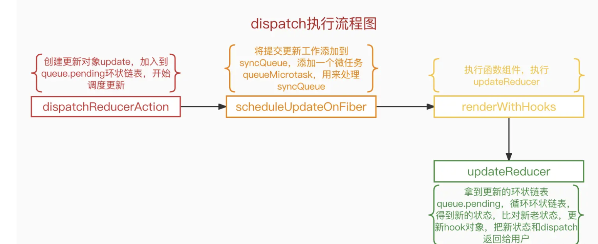
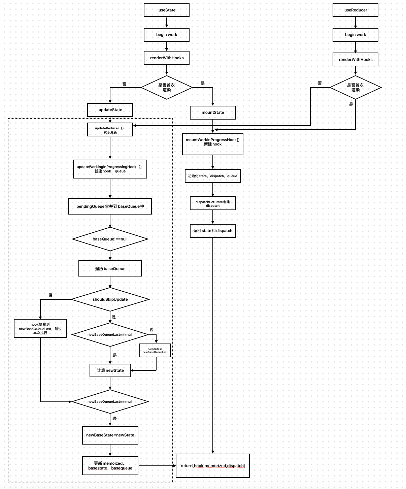

# React源码之useReducer

## 1.前言

书接[上文](React全家桶/React源码解读/React源码之useState.md)，我们系统性的讲了useState的实现，以及hook的[实现原理](React全家桶/React-Hooks实现原理.md)，hook的内容相似度很好，在对整个流程有了了解之后，剩下的就是封装不同API的事情了。

## 2.useReducer源码解读

### 2.1 mount阶段

在 mount 阶段，当用到 `useReducer` 方法时，会调用 `mountReducer` 

```js
const HooksDispatcherOnMount: Dispatcher = {
  …………
  useReducer: mountReducer,
  …………
};
```

`mountReducer` ： 创建hook对象，得到初始状态，创建queue队列，同时生成一个dispatch.

不难发现其实和mountState类似，但有存在不同，即生成初始状态，判断是否有第三个参数

```js
const [state,dispatch] = useReducer(reducer,initState,init)
/*
		useReducer接收三个参数：
		第一个参数：reducer函数用来操作state
		第二个参数：初始化的state。若没有init，则state默认是传入的值，返回值是最新的state和dispatch函数（用来触发reducer函数，计算state）
		第三个（非必需）：是一个 Function，若有则对初始值state进行更新
*/
```

```js
function mountReducer<S, I, A>(
  reducer: (S, A) => S,
  initialArg: I,
  init?: I => S,
): [S, Dispatch<A>] {
  // 创建 hook 对象
  const hook = mountWorkInProgressHook();
  // 生成初始状态，是否有第三个参数
  let initialState;
  if (init !== undefined) {
    // 若有，则对初始值state（initialState）进行更新 init（initialArg）
    initialState = init(initialArg);
  } else {
    initialState = ((initialArg: any): S);
  }
  hook.memoizedState = hook.baseState = initialState;
  // 创建 queue
  const queue: UpdateQueue<S, A> = {
    …………
  };
  hook.queue = queue;
  // 生成 dispatch
  const dispatch: Dispatch<A> = (queue.dispatch = (dispatchReducerAction.bind(...): any));
  return [hook.memoizedState, dispatch];
}
```

完整流程如下：

1. 通过 `mountWorkInProgressHook` 创建 hook 对象
2. 判断是否需要对初始值`initialArg`进行更新
3. 根据用户传递的参数，进行 `state` 的初始化
4. 把初始状态挂到 `memoizedState` 和 `baseState` 上
5. 创建 `queue` 链表，挂到 `hook` 上
6. 生成 `dispatch` 并返回数组

#### 2.1.1 dispatchReducerAction--生成 Dispatch 函数

使用dispatchReducerAction函数生成dispatch函数

```js
function dispatchReducerAction<S, A>(
  fiber: Fiber,
  queue: UpdateQueue<S, A>,
  action: A,
) {
  const lane = requestUpdateLane(fiber);

  const update: Update<S, A> = {
    lane,
    action,
    hasEagerState: false,
    eagerState: null,
    next: (null: any),
  };

  if (isRenderPhaseUpdate(fiber)) {
    enqueueRenderPhaseUpdate(queue, update);
  } else {
    //将update,加入到queue.pending环状链表中
    //多次调用dispatch，创建的update都会加入到这个queue.pending环状链表中；
    const root = enqueueConcurrentHookUpdate(fiber, queue, update, lane);
    if (root !== null) {
      const eventTime = requestEventTime();
      scheduleUpdateOnFiber(root, fiber, lane, eventTime);
      entangleTransitionUpdate(root, queue, lane);
    }
  }
}
```

1. 首先会去获取本次更新的优先级

2. 然后创建 update

3. 判断是否是 re-render 引起的更新（和dispatchSetState一样）

   ​	如果是那就执行 `enqueueRenderPhaseUpdate`，会将 update 加到 queue.pending 中，具体可看[上一节](React全家桶/React源码解读/React源码之useState.md)

4. 如果不是 re-render 的更新，也会将 `queue` 加入到 queue.pending 中，返回当前的 `root` 节点，然后调用 `scheduleUpdateOnFiber` 开始更新调度

dispatch执行流程流程如下**网图**所示：



### 2.2 update阶段

这部分和 `useState` 一致，可以看[useState源码解析](React全家桶/React源码解读/React源码之useState.md)

1. 根据上次更新或加载后，存储的组件 `fiber` 的 `hook` 对象，创建新的 `hook` 对象；
2. 拿到 `hook` 的更新对象环状链表 `queue.pending`，循环环状链表，算出新的状态；
3. 判断新老状态，如果不一样就标记更新；
4. 把新的状态存储到 hook 对象；
5. 把新的状态和 dispatch 返回给用户；

### 2.3 useState和useReducer的区别

行文至此，你或许有疑惑，既然useState和useReducer如此相近，为什么还要搞两个hook？

首先，一些明显的不同，在使用上也能感受到：

- `useState` 只需要传递一个状态即可，而 `useReducer` 需要 `reducer` 和状态，使用上来说，`useState` 对开发者更加友好

但如果当我们需要描述很多状态又或者是一个数组/对象时，就需要不停的申明使用useState，因此我们通常认为useReducer是useState的替代方案，通常使用场景如下：

- 如果你的state是一个数组或者对象
- 如果你的state变化很复杂，经常一个操作需要修改很多state
- 如果你希望构建自动化测试用例来保证程序的稳定性
- 如果你需要在深层子组件里面去修改一些状态（关于这点我们下篇文章会详细介绍）
- 如果你用应用程序比较大，希望UI和业务能够分开维护

## 3.总结

在[useState源码解析](React全家桶/React源码解读/React源码之useState.md)中我们系统性总结了useState的执行过程，由于useState和useReducer及其接近，于是重新整理一版useState + useReducer的执行过程



至此useReducer源码解析结束🔚！
