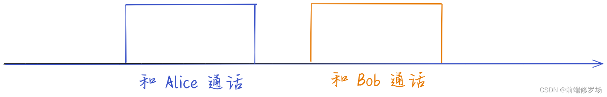
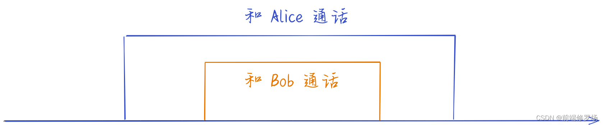

# React源码之useTransition

## 0.知识储备

### 0.1 什么是并发？

> **这是React18提出的新概念**

来自官方示例：

假设我们需要给两个人打电话——Alice 和 Bob。 在**非并发**设置中，我们**一次只能有一个呼叫**。 我们会先打电话给 Alice，结束通话后，再打电话给 Bob。

**当通话时间很短时这很好，但是如果与 Alice 的通话等待时间很长（例如等待），这可能是会是一个问题。**




在并发设置中，**我们可以打电话给 Alice，一旦我们被搁置，我们就可以打电话给 Bob**。

**这并不意味着我们同时与两个人交谈。** 它只是**意味着我们可以同时有两个或多个并发调用，并决定哪个调用更重要**。



## 1.基本概念

`Transition` 是 React 18中的一个新概念，它用来帮助我们实现更新协调可中断，能极大的提升用户体验。用于区分**紧急和非紧急更新**

- 紧急更新反映了直接交互，例如键入、单击、按下等。
- 过渡更新表示将 UI 从一个视图转换到另一个视图。

打字、点击或按下等紧急更新需要立即响应，以符合我们对物理对象行为方式的直觉。否则用户会觉得“不对劲”。但是，过渡是不同的，因为用户不希望在屏幕上看到每个中间值。

例如下面的例子：当滑块滑动条时，下方的图表会一起更新，然而图表更新比较耗时。阻塞了渲染导致页面失去响应，用户能够非常明显的感受到**卡顿**。

在 `useTransition` 之前，我们会采用 `useState` 创建**两个 State**，去更新滑动条和图表

```js
setSlider(10)
setGraph(xxx)
```

这是因为在处理状态更新时，`setGraph` 触发的更新非常的耗时，而 `setSlider` 的触发又非常的频繁，就很有可能导致 `setGraph` 任务还没有做完，`setSlider` 任务又来了，React 没有办法及时的响应，导致了页面卡顿


可以看到当我们使用 `transition`，将这个耗时但又不是非常紧急的任务放到 `startTransition` 里去做，效果就不一样了

核心原理就是在 setGraph 的更新优先级被降低了，slider 的频繁更新会打断 graph 的更新，这样不会阻塞渲染，体验上会更加友好一些

```js
setSlider(input);
startTransition( () => {
    setGraph(input);
}); 
```


**不得不说比之前丝滑不少！**

Ok，我们从 `useTransition` 的使用到实现原理来讲解这个全新的 hook

## 2.使用useTransition

> 来自官网示例

```js
const [isPending, startTransition] = useTransition();
```

返回一个状态值`isPending`**表示过渡任务的等待状态**，以及一个启动该过渡任务的函数`startTransition`。

`startTransition` 允许你通过标记更新将提供的回调函数作为一个过渡任务：

```js
startTransition(() => {
  setCount(count + 1);
})
```

`isPending` 表示过渡任务何时活跃以显示一个等待状态，反应了当前的 startTransition 回调事件是否做完

```js
function App() {
  const [isPending, startTransition] = useTransition();
  const [count, setCount] = useState(0);
  
  function handleClick() {
    startTransition(() => {
      setCount(c => c + 1);
    })
  }

  return (
    <div>
      {isPending && <Spinner />}
      <button onClick={handleClick}>{count}</button>
    </div>
  );
}
```

## 3.mountTransition

核心其实就是通过 `useState` 维护了一个 `pending`，然后将 `setPending` 作为参数传递给 `startTransition`

当任务执行完成就会调用这个 `dispatch` 去更新 `isPending` 的状态

```js
function mountTransition(): [boolean, (() => void) => void] {
  const [isPending, setPending] = mountState(false);
  const start = startTransition.bind(null, setPending);
  const hook = mountWorkInProgressHook();
  hook.memoizedState = start;
  return [isPending, start];
}
```

## 4.updateRef

```js
function updateTransition(): [
  boolean,
  (callback: () => void, options?: StartTransitionOptions) => void,
] {
  const [isPending] = updateState(false);
  const hook = updateWorkInProgressHook();
  const start = hook.memoizedState;
  return [isPending, start];
}
```
