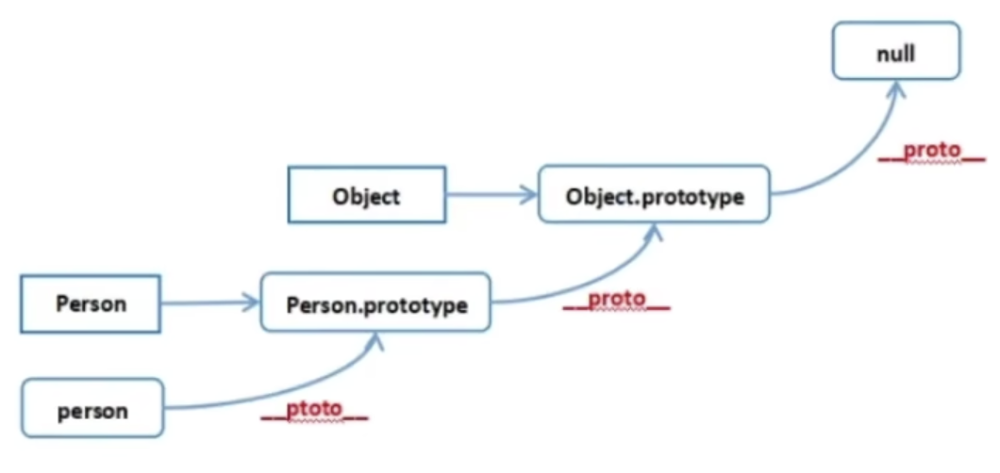

## 手写instanceOf

```js
/*
	思路: 原型和原型链的相关知识
	原型: 每一个函数都有自己的prototype属性，指向自己的原型（或原型对象），上面有一些它的属性和方法
	原型链: 每一个对象通过__proto__指向自己的原型对象，原型对象同时也是一个对象，
				 也有__proto__属性指向原型对象的原型对象，这样一层层往上找，直到找到null，
				 这种链式结构称之为原型链
*/
```



```js
function myInstanceOf(L,R){
  let RP = R.prototype
  let LP = L.__proto__
  while(true){
    if(LP === null){
      return false
    }
    if(LP = RP){
      return true
    }
    LP = LP.__proto__
  }
}
```


