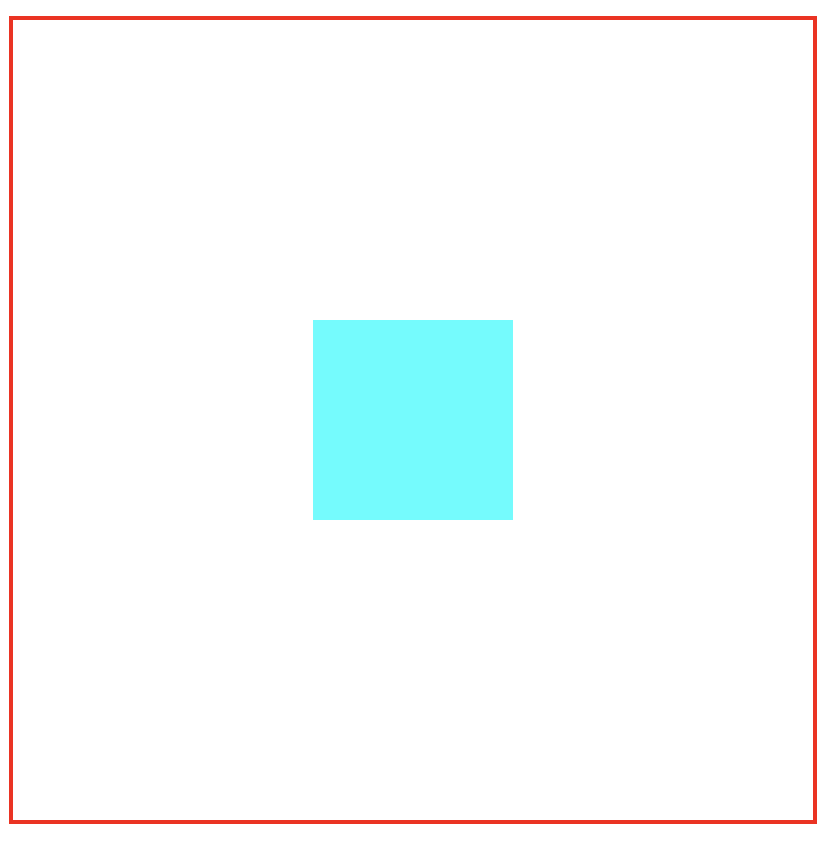
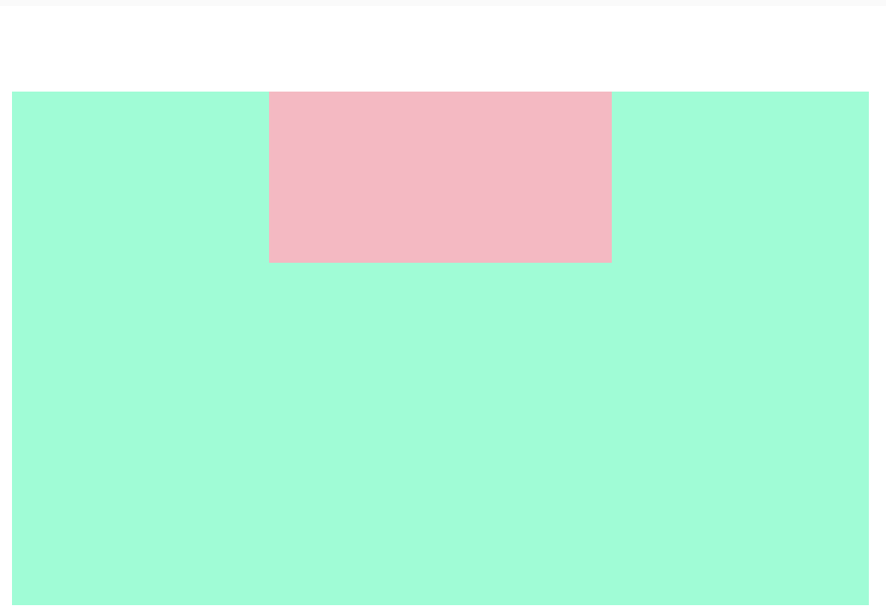
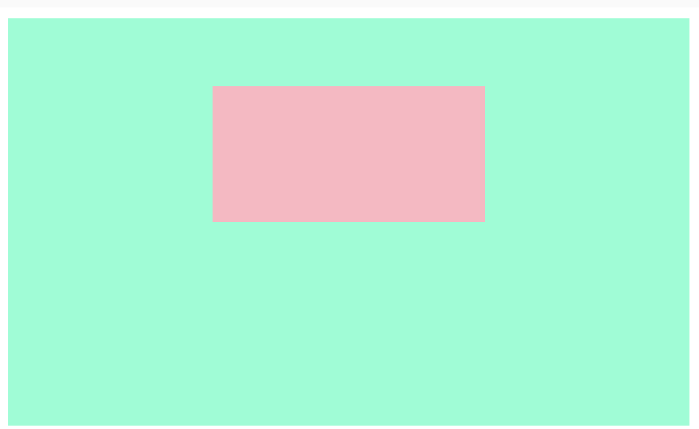

## 📒 HTML&CSS面试题合集

### ⭐️- HTML5 新特性、语义化

#### 1.概念

```markdown
HTML5语义化是指使用合理的正确的标签来布局页面【正确的标签做正确的事情】
```

#### 2.语义化标签

```css
<nav></nav>,
<header></header>,
<footer></footer>,
<main></main>,
<section></section>,
<article></article>……
```

#### 3.语义化优点

```markdown
1.增强页面可读性与可维护性
2.即使在没有css的加持下，也能很好的呈现页面
3.代码清晰，利于阅读
4.利于开发和维护
5.利于seo，爬虫会根据不同标签来赋予不同的权重
```

------

### - HTML5新特性有哪些

- 语义化的标签：header，footer，nav，article，section……
- 音视频处理
- canvas/webgl
- web存储 localstorage/sessionstorage
- websocket
- history API
- 表单控件 calendar、date、time、email、url、search

------

### ⭐️- CSS 选择器及优先级

#### 选择器：

- id选择器（#xxx）
- 类选择器（.xxx）
- 属性选择器(a[rel="external"])
- 伪类选择器（:hover）
- 通配符（*）
- 标签选择器（div，p，span……）
- 子选择器（ul>li）
- 后代选择器（ul,li）
- 相邻选择器（hi+p）

#### 优先级：

**！important>内联样式>id选择器>类选择器/属性选择器/伪类选择器>标签选择器>通配符选择器**

------

### - 渐进增强与优雅降级的理解及区别

**渐进增强（Progressive Enhancement）：**
一开始就**针对低版本浏览器进行构建页面**，完成基本的功能，然后再针对高级浏览器进行效果、交互、追加功能达到更好的体验。

**优雅降级（Graceful Degradation）：**
一开始就**构建站点的完整功能**，然后针对浏览器测试和修复。比如一开始使用 CSS3 的特性构建了一个应用，然后逐步针对各大浏览器进行 hack 使其可以在低版本浏览器上正常浏览。
**两者区别**
1、广义：
其实要定义一个基准线，在此之上的增强叫做渐进增强，在此之下的兼容叫优雅降级
2、狭义：
渐进增强一般说的是使用CSS3技术，在不影响老浏览器的正常显示与使用情形下来增强体验，而优雅降级则是体现html标签的语义，以便在js/css的加载失败/被禁用时，也不影响用户的相应功能。

```css
/* 例子 */
.transition { /*渐进增强写法*/
  -webkit-transition: all .5s;
     -moz-transition: all .5s;
       -o-transition: all .5s;
          transition: all .5s;
}
.transition { /*优雅降级写法*/
          transition: all .5s;
       -o-transition: all .5s;
     -moz-transition: all .5s;
  -webkit-transition: all .5s;
}
```

------

### ⭐️【美团】什么是响应式设计？响应式设计的基本原理是什么？如何进行实现？

- 是一种网络页面设计布局，设计一个网站兼容不同的终端。
- 通过**媒体查询@media**，检测视口的分辨率，查询针对不同宽度的设备然后进行布局和样式的设置，来展现不同的布局和内容，从而适配不同设备的目的。
- 比较常用的实现方式：
  - 媒体查询+rem布局：通过@media查询匹配不同屏幕宽度的设备，来设置不同的根元素html的font-size属
  - flex弹性布局：给父盒子容器添加flex属性，来控制子盒子的位置排列方式，从而实现flex布局
  - Bootstrap的网格系统和栅格系统布局

------

### ⭐️-媒体查询

媒体查询是css3的新语法。

- 使用媒体查询，可以针对不同媒体类型定义不同的样式。
- 针对不同屏幕尺寸设置不同的样式
- 目前针对很多ios，Android，平板等设备都用得到媒体查询

------

### ⭐️【美团】行级元素和块级元素

行级元素：span,a,i,b,label

- 多个共占一行
- 不能设置宽高，上下内外边距
- 宽度高度根据内容自动填充

块级元素：div,h1-h6,ul,li,form....

- 独占一行
- 可以设置宽高以及内外边距
- 如果不设置宽高，宽度默认是父级元素宽度，高度根据内容进行填充

------

### ⭐️-讲一下sass,less,css

sass和less都是css的预处理器，最终都会编译成css

sass/less的优点：

- 结构清晰，易于拓展
- 很好的屏蔽浏览器的语法差异
- 轻松实现多重继承

------

### ⭐️-BFC

#### 概念：

**块级格式化上下文**，是一个完全独立的空间（布局环境），让**空间里的子元素不会影响到外面的布局**。听过一句很精辟的话：**bfc是css的块级作用域**

#### 怎么触发：

```css
overflow:hidden
display:inline-block / table-cell / flex
position:absolute / fixed
```

#### 应用：

- 防止margin重叠【水平居中可能会用到】
- 清除内部浮动
- 自适应两栏布局
- 自适应两栏布局

------

### ⭐️-常见的布局单位

像素px，百分比%，em（文字相对长度），rem，vw（视窗宽度）/vh（视窗高度），vmin，vmax

#### 引申出的问题：CSS 中的 1 像素问题是什么？有哪些解决方案？

高分辨率屏幕上1px的边框或者细线，会比1物理像素更宽或者更粗，影响用户体验。

解决方法：

（1）用图片来代替边框或细线，但增加了页面加载开销

（2）使用transform中的scale进行缩放，缩放 0.5像素大小的边框

------

### ⭐️【阅文】垂直居中/水平居中的方法

> **一个元素要想实现垂直/水平居中，必须要有一个参照物，这个参照物要么是父级div元素，要么就是body元素。**

```html
<body>
    <div class="box1">
        <div class="box2"></div>
    </div>
</body>
```

#### 1.垂直居中




```css
/* flex + justify-content(主轴) + align-items（侧轴） */
.box1{
    width: 400px;
    height: 400px;
    border: 2px solid red;
    display: flex;
    align-items: center;
    justify-content: center;
}
.box2{
    width: 100px;
    height: 100px;
    background-color: aqua;
}
```

```css
/* position + transform:translate(-50%,-50%)*/
.box1 {
    width: 400px;
    height: 400px;
    border: 2px solid red;
    position: relative;
}
.box2 {
    position: absolute;
    width: 100px;
    height: 100px;
    top: 50%;
    left:50%;
    transform:translate(-50px,-50px);
    background-color: aqua;    
} 
```

```css
/* position + margin -盒子宽高 */
.box1 {
    width: 400px;
    height: 400px;
    border: 2px solid red;
    position: relative;
}
.box2 {
    position: absolute;
    width: 100px;
    height: 100px;
    top: 50%;
    left:50%;
    margin: -50px 0 0 -50px;
    background-color: aqua;    
}
```

```css
/* position + margin:auto */
.box1 {
    width: 400px;
    height: 400px;
    border: 2px solid red;
    position: relative;
}
.box2 {
    position: absolute;
    width: 100px;
    height: 100px;
    top: 0;
    left:0;
    right: 0;
    bottom: 0;
    margin: auto;
    background-color: aqua;    
}
```

```css
/* 文本的时候，设置子元素line-height等于父元素的height */
```


#### 2.水平居中

```css
1. margin auto
2. positon + left + margin-left回退 
3. positon + left + transform:translateX(-50%)
4. flex + justify-content：center
5. 文本：text-align:center
```

##### 2.1 一个注意点

使用方法1如果使小盒子上下也有一个边距，可以使用`margin：xxx ，auto`但会造成两个盒子一起往下窜，如下图



这种情况的出现是由 **margin塌陷** 导致的，可以将父元素box变为BFC：`overflow: hidden;` （注意**不是**超出隐藏的作用）



```css
.box1{
  overflow: hidden;
	width: 500px;
	height: 300px;
	background-color: aquamarine;
}
.box2{
	width: 200px;
	height: 100px;
    margin: 50px auto;
	background-color: lightpink;
}
```

### ⭐️【阅文】两栏布局的实现方式

```css
/* flex */
/* 父容器：flex，左容器正常写，右容器flex；1 */
.box{
    display: flex;
    height: 500px;
}
.box1{
    width: 200px;
    background-color: aqua;
}
.box2{
    flex: 1;
    background-color: blueviolet;
}

/* float + bfc */
/* 父容器正常写，左容器float固定大小，右容器bfc，就不会重叠了*/
.box{
    width: 700px;
    height:700px;
}
.box1{
    float: left;
    width: 200px;
    height: 500px;
    background-color: aqua;
}
.box2{
    height: 500px;
    overflow: auto;
    background-color: blueviolet;
}
```

**flex：1 自动填满剩下空间，一般用于自适应布局**

### ⭐️ 三栏布局【左右固定大小，中间自适应】的实现方式

```css
/* 父容器：flex，左右固定大小，中间flex:1，注意中间的盒子一定要放在中间 */
.main{
    display: flex;
    height: 400px;
    border: 1px solid red;
}
.left,.right{
    width: 200px;
    background-color: black;
}
.middle{
    flex: 1;
    background-color: aqua;
}
```

