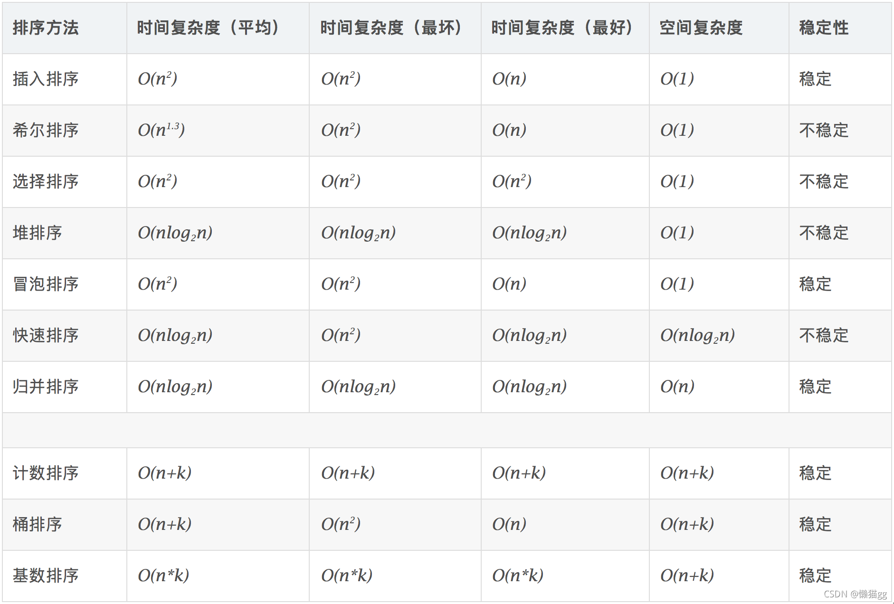
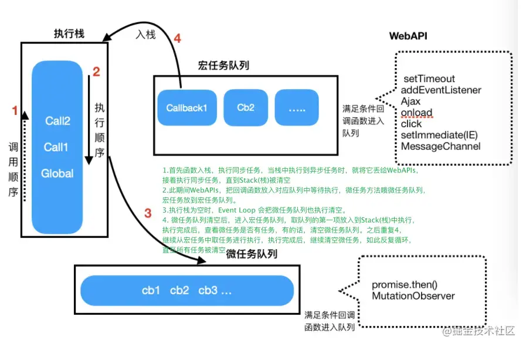
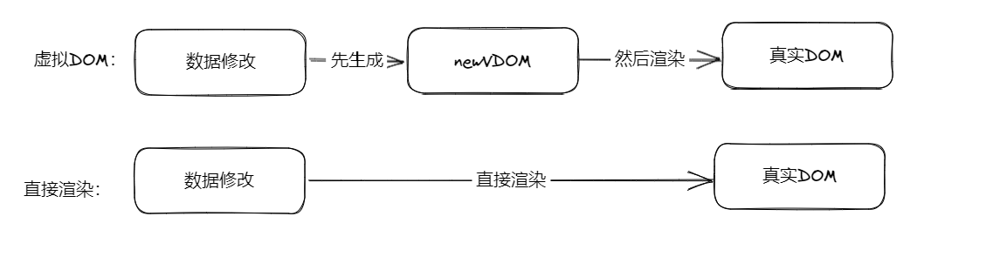

## 📒 JavaScript面试题合集

### JS中的8种数据类型及区别

#### 1.基本数据类型

```markdown
number，string，null，undefined，boolean，symbol，bigInt
```

```markdown
数据存放在栈中
```

#### 2.引用数据类型

```markdown
object,array,function,date,reg（正则）
```

```markdown
数据存放于堆中，在栈中存放数据的标识符及堆中存放数据的地址
```

------

### JS中的数据类型检测方案

#### 1.typeof

```js
console.log(typeof 1);               // number
console.log(typeof true);            // boolean
console.log(typeof 'mc');            // string
console.log(typeof Symbol)           // function
console.log(typeof function(){});    // function
console.log(typeof console.log());   // function
console.log(typeof []);              // object 
console.log(typeof {});              // object
console.log(typeof null);            // object
console.log(typeof undefined);       // undefined
```

优点：能够快速区分基本数据类型

**缺点**：**不能将Object、Array和Null区分，都返回object**

#### 2. instanceof

```js
console.log(1 instanceof Number);                    // false
console.log(true instanceof Boolean);                // false 
console.log('str' instanceof String);                // false  
console.log([] instanceof Array);                    // true
console.log(function(){} instanceof Function);       // true
console.log({} instanceof Object);                   // true
```

优点：能够区分Array、Object和Function，适合用于判断自定义的类实例对象。**还可以在继承关系中用来判断一个实例是否属于它的父类型**

**缺点：Number，Boolean，String基本数据类型不能判断**

#### 3. constructor

```js
let a = 1
let b = 'abc'
let c = true
console.log(a.constructor === Number) // true
console.log(b.constructor === String) // true
console.log(c.constructor === Boolean) // true
```

优点：相比于instanceof可以检测基本数据类型

#### 4. Object.prototype.toString.call()

```js
var toString = Object.prototype.toString;
console.log(toString.call(1));      //[object Number]
console.log(toString.call(true));   //[object Boolean]
console.log(toString.call('mc'));   //[object String]
console.log(toString.call([]));     //[object Array]
console.log(toString.call({}));     //[object Object]
console.log(toString.call(function(){})); //[object Function]
console.log(toString.call(undefined));  //[object Undefined]
console.log(toString.call(null)); //[object Null]
```

优点：精准判断数据类型

缺点：写法繁琐不容易记，推荐进行封装后使用

##### ⭐️  为什么要用call？

两点：

（1）改变this指向，指向我们判断的目标变量，因此用apply也是可以的

（2）因为每个数据的原始toString方法都将被改写，通过call，让该数据调用object上的toString方法，用以判断当前数据类型。

------

### ⭐️ 作用域和作用域链

**作用域：**规定变量和函数可作用的范围。

**作用域链：**每个函数都有一个作用域链，当查找变量或者函数时，会从局部作用域到全局作用域依次查找，这个作用域的集合就是作用域链。

------

### ⭐️ 闭包？常见的闭包有哪些？引起内存泄露？

#### **闭包：**

变量的作用域属于函数的作用域。当函数执行完成时，内存会被释放，但是闭包函数是函数内部的子函数，它可以访问上级的作用域，即使上级函数执行完作用域也不会被清除。简而言之**闭包就是可以访问另一个函数作用域中变量的函数。**

#### **常见的闭包：**

**ajax请求、定时器的回调，防抖和节流，函数柯里化**

#### **内存泄漏：**

什么是？内存泄漏是指不再用的内存没有被及时的释放出来，导致该内存段无法继续被使用。

策略？标记清除法和引用计数法

（1）全局变量【严格模式】；（2）被遗忘的定时器和回调函数【用完清除】；（3）闭包；（4）DOM的引用【赋null】

------

### ⭐️函数柯里化

> 多个参数的函数变换成1个单一参数的函数，并且转换成一个函数，该函数可以接受小于原始函数参数个数，并且等到累计参数个数与原始函数接受参数个数一致时，返回结果。

**核心：函数里面返回函数，做到参数复用**

场景：（1）参数复用（2）延时执行（3）提前确认

------

### ⭐️讲一讲promise

- promise是一种异步编程解决方案，解决了传统的解决方案回调函数中的**回调地狱**的问题，并且更加灵活易懂
- promise实例具有三种状态：pending，fufilled，rejected三种状态
  - 但是变化途径只有两种：pending---fufilled 或 pending --- rejected，状态一旦变化就凝固了。
- new promise（）接收一个函数，入参为resolve和reject
  - resolve（）进入 . then也就是执行成功的回调 ； reject（）进入 . catch失败的回调手动的捕获异常

- Promise对象方法有：
  - Promise.resolve：将现有对象转化为promise对象
  - Promise.reject：返回一个promise实例，该实例状态为rejected
  - ⭐️【手写题】Promise.all：将多个promise实例包装成1个新的promise实例
    - 其状态由all里面的promise实例决定，都为fulfilled才会变成fulfilled；只要有一个rejected，其状态就会变成rejected，并且返回第一个被rejected实例的返回值

#### 延伸问题：async/await

promise搭配async/await可以将promise链式调用变为类似同步代码的形式。async/await必须在函数中使用，在函数钱加上async，await关键字后面是一个promise对象，并且返回该对象的值，看起来代码结构更加清晰。

------

###  == 和 ===区别是什么？

- ==是基于类型转换的相等，也就是先类型转换在比较

```js
null == undefined // true
1 == '1' //true
true == 1 // true
true == '1' //true
```

- ===是严格相等，不做任何的类型转换

------

### new运算符的实现机制

1.  首先创建了一个新的`空对象`
1.  `设置原型`，将对象的原型设置为函数的`prototype`对象。
1.  让函数的`this`指向这个对象，执行构造函数的代码（为这个新对象添加属性）
1.  判断函数的返回值类型，如果是值类型，返回创建的对象。如果是引用类型，就返回这个引用类型的对象。

------

### ⭐️【小米】怎么判断质数？

1. 判断是否为number类型，是否是整数，是否小于2，满足其一返回false
2. === 2时，返回true
3. 对n开算数平方根，此时算数平方根处于3-9，for循环遍历，如果n%i==0返回false，都不是就返回true

------

### 谈谈oop的理解

js是面向对象语言，一切即可对象，很重要的一点，在实际编程中，可以只关注功能，不关注内部细节的编程思想，就是面向对象。抽象，封装，继承等特性。

------

### 了解哪些排序算法？并说一下快排原理

冒泡，快排，插入，选择，桶排，堆排……



#### 快排原理：

1. 选择一个元素作为基准点
2. 排序数组，比基准小的放在左边，比基准大的，放在右边。分割结束后，基准插入到中间去。
3. 递归，将放在左边和右边的数组进行1和2的操作

```js
var quickSort = function (arr){
  if(arr.length <= 1){
    return arr
  }
  let pivotIndex = Math.floor(arr.length / 2)
  let pivot = arr.splice(pivotIndex,1)[0]
  let left = [] , right = []
  for(let i = 0; i<arr.length; i++){
    if(arr[i] < pivot){
      left.push(arr[i])
    }else{
      right.push(arr[i])
    }
  }
  return quickSort(left).concat(pivot,quickSort(right))
}
```

### 原型 && 原型链

‌ **原型:**  在 JS 中，每个函数对象都有一个`prototype` 属性，这个属性指向函数的原型也称原型对象。

- 原型上可以存放属性和方法，共享给实例对象使用
- 原型可以做继承

**原型链**：对象都有__proto__属性指向对象的原型（对象），同时原型又是对象也有__proto__属性，指向原型对象的对象。因此可以利用__proto__一直指向Object的原型对象上，而Object原型对象用Object.prototype.__ proto__ = null表示原型链顶端。如此形成了js的原型链继承。同时所有的js对象都有Object的基本防范

**特点:**  `JavaScript`对象是通过引用来传递的，我们创建的每个新对象实体中并没有一份属于自己的原型副本。当我们修改原型时，与之相关的对象也会继承这一改变。

### 深浅拷贝

基本数据类型放在栈中，引用数据类型将真实数据放在堆中并在栈中存放该真实数据的指针，该指针指向堆中真实数据的起始地址。

**浅拷贝**只是复制了某对象的指针，并不复制对象本身，新旧对象还是共享同一内存，一变都变。但是**深拷贝**会另外创造一个一模一个的对象，新旧对象不共享内存，修改一个并不会影响另一个

### JS 中 this 的情况

1. 普通函数调用：通过函数名()直接调用：`this`指向`全局对象window`（注意let定义的变量不是window属性，只有window.xxx定义的才是。即let a =’aaa’; this.a是undefined）
2. 构造函数调用：函数作为构造函数，用new关键字调用时：`this`指向`新new出的对象`
3. 对象函数调用：通过对象.函数名()调用的：`this`指向`这个对象`
4. 箭头函数调用：箭头函数里面没有 this ，所以`永远是上层作用域this`（上下文）
5. apply和call调用：函数体内 this 的指向的是 call/apply 方法`第一个参数`，若为空默认是指向全局对象window。
6. 函数作为数组的一个元素，通过数组下标调用的：this指向这个数组
7. 函数作为window内置函数的回调函数调用：this指向window（如setInterval setTimeout 等）

### 什么是箭头函数？能使用 new 来创建箭头函数么？

1. 相比普通函数，箭头函数有**更加简洁的语法**。
2. 箭头函数不绑定this，会**捕获其所在上下文的this**，作为自己的this。

箭头函数的外层如果有普通函数，那么箭头函数的this就是这个外层的普通函数的this，箭头函数的外层如果没有普通函数，那么箭头函数的this就是全局变量. 下面这个例子是箭头函数的外层有普通函数。

```arcade
let obj = {
  fn:function(){
      console.log('我是普通函数',this === obj)   // true
      return ()=>{
          console.log('我是箭头函数',this === obj) // true
      }
  }
}
console.log(obj.fn()())
```

下面这个例子是箭头函数的外层没有普通函数。

```js
let obj = {
    fn:()=>{
        console.log(this === window);
    }
}
console.log(obj.fn())// true
```

3. 箭头函数没有constructor是匿名函数，不能作为构造函数，**不可以使用new命令**，否则后抛出错误。 需要注意的是，箭头函数不能用作构造函数，也就是不能通过 new 关键字来创建实例。因为箭头函数没有自己的 this，而是继承了外层作用域的 this。如果用 new 来创建实例，就会出现意料之外的结果。
4. `箭头函数不绑定Arguments 对象`。取而代之用rest参数...解决。由于 箭头函数没有自己的this指针，通过 call() 或 apply() 方法调用一个函数时，只能传递参数（不能绑定this），他们的第一个参数会被忽略。（这种现象对于bind方法同样成立）

参考：[箭头函数与普通函数的区别](https://www.cnblogs.com/biubiuxixiya/p/8610594.html)

### EventLoop 事件循环

`JS`是单线程的，为了防止一个函数执行时间过长阻塞后面的代码，所以会先将同步代码压入执行栈中，依次执行，将异步代码推入异步队列，异步队列又分为宏任务队列和微任务队列，因为宏任务队列的执行时间较长，所以微任务队列要优先于宏任务队列。微任务队列的代表就是，`Promise.then`，`MutationObserver`，宏任务的话就是`setImmediate setTimeout setInterval`

JS运行的环境。一般为浏览器或者Node。 在浏览器环境中，有JS 引擎线程和渲染线程，且两个线程互斥。 Node环境中，只有JS 线程。 不同环境执行机制有差异，不同任务进入不同Event Queue队列。 当主程结束，先执行准备好微任务，然后再执行准备好的宏任务，一个轮询结束。

#### **浏览器中的事件环（Event Loop)**

事件环的运行机制是，先会执行栈中的内容，栈中的内容执行后执行微任务，微任务清空后再执行宏任务，先取出一个宏任务，再去执行微任务，然后在取宏任务清微任务这样不停的循环。

- eventLoop 是由JS的宿主环境（浏览器）来实现的；

- 事件循环可以简单的描述为以下四个步骤:

  1.  函数入栈，当Stack中执行到异步任务的时候，就将他丢给WebAPIs,接着执行同步任务,直到Stack为空；
  1.  此期间WebAPIs完成这个事件，把回调函数放入队列中等待执行（微任务放到微任务队列，宏任务放到宏任务队列）
  1.  执行栈为空时，Event Loop把微任务队列执行清空；
  1.  微任务队列清空后，进入宏任务队列，取队列的第一项任务放入Stack(栈）中执行，执行完成后，查看微任务队列是否有任务，有的话，清空微任务队列。重复4，继续从宏任务中取任务执行，执行完成之后，继续清空微任务，如此反复循环，直至清空所有的任务。

  

- 浏览器中的任务源(task):

  -   `宏任务(macrotask)`：\
      宿主环境提供的，比如浏览器\
      ajax、setTimeout、setInterval、setTmmediate(只兼容ie)、script、requestAnimationFrame、messageChannel、UI渲染、一些浏览器api
  -   `微任务(microtask)`：\
      语言本身提供的，比如promise.then\
      then、queueMicrotask(基于then)、mutationObserver(浏览器提供)、messageChannel 、mutationObersve

- **为什么有宏任务和微任务之分？**

宏任务和微任务之所以被区分开来，是因为它们的执行顺序和优先级不同。宏任务是由浏览器或Node.js环境发起的任务，例如I/O操作、定时器等，而微任务是由JavaScript引擎发起的任务，例如Promise、MutationObserver等。

宏任务和微任务的执行顺序也不同。当执行完一个宏任务后，浏览器会检查是否有微任务需要执行，如果有则执行所有微任务，然后再执行下一个宏任务。也就是说，微任务的执行优先级比宏任务更高，它们会在下一个宏任务执行之前尽可能地执行完毕。

这种区分宏任务和微任务的方式，可以帮助我们更好地控制异步任务的执行顺序和优先级，从而提高应用程序的性能和可维护性。**例如，我们可以将一些高优先级的任务放到微任务中执行，以确保它们能够尽快地执行完毕，从而提高应用程序的响应速度和用户体验。**

传送门 ☞ [# 宏任务和微任务](https://juejin.cn/post/7001881781125251086)

------

### 怎么用 JS 实现大型文件上传？要考虑哪些问题？

- 分片上传：将要上传的大文件分割成多个小文件（片）进行上传，避免一次性上传大文件导致上传的时间过长，网络中断等问题。通常情况下，每个片的大小为**1M**左右。
- 断点续传：由于网络的原因，上传过程中可能出现中断，此时需要能够从中断的地方恢复上传。
- 并发上传：多个文件同时上传，需要对上传队列进行管理，保证上传的素的和顺序。
- 上传进度显示：及时的显示上传进度，让用户知道上传的进度和状态。

可以借助第三方库来实现大型文件上传，如[Plupload](https://www.plupload.com/)、[ResumableJs](https://github.com/23/resumable.js#readme)等

------

### 什么是 JS 对象的可枚举性（enumerable）？

对象中某些属性是否可以被 for...in 循环或者 Object.keys()函数枚举到，如果一个属性是可枚举的，则会出现在枚举过程中，反之则不会。

默认情况下，使用字面量或Object()构造函数创建的对象的所有属性都是可枚举的，可以使用Object.defineProperty或Object.defineProperties(对象,属性,{配置项})来设置enumerable特性为false，设置其不可枚举

------

### 什么是虚拟 DOM？使用虚拟 DOM 一定更快吗？

虚拟 DOM（Virtual DOM）是一种将浏览器 DOM 抽象为 JavaScript 对象的技术，用于提高 DOM 操作的效率和性能。虚拟 DOM 可以在渲染前对组件的变化进行计算，减少 DOM 操作的次数，从而提高渲染性能。



从图中一看便知，肯定是第2种方式比较快，因为第1种方式中间还夹着一个虚拟DOM的步骤，所以虚拟DOM比真实DOM快 这句话是错的，或者说不严谨。正确的说法应该是：虚拟DOM算法操作真实DOM，性能高于直接操作DOM，虚拟DOM和虚拟DOM算法是两种概念。**虚拟DOM算法 = 虚拟DOM + Diff算法**

------

### ES6 中的 Reflect 对象有什么用？

**（1）简化了操作对象：Reflect方法是函数式，Object方法是命令式**

```js
const person = { name: 'Tom' }
const objName = Object.getOwnPropertyDescriptor(person, 'name').value
const reflectName = Reflect.get(person, 'name')
console.log(objName) // 'Tom'
console.log(reflectName) // 'Tom'
```

**（2）对对象添加属性或修改现有属性时，Reflect.definePrototype()返回值更加清晰简单返回一个Boolean值，而Object.definePrototype（）会返回一个对象**

```js
const person = { name: 'Tom' }
const objPerson = Object.defineProperty(person, 'sex', {
    value: '男',
    enumerable: true,
    writable: true,
    configurable: true
})
const reflectPerson = Reflect.defineProperty(person, 'sex', {
    value: '男',
    enumerable: true,
    writable: true,
    configurable: true
})
console.log(objPerson); //todo   { name: 'Tom', sex: '男' }
console.log(reflectPerson); // true
```

（3） Reflect和proxy搭配使用，可以实现数据劫持，是vue3响应式的基础。

```js
//1 Reflect proxy响应式
const person = { name: 'Tom' }
const proxy = new Proxy(person, {
   get(target, propName) {
      console.log('已经获取属性了！');
      return Reflect.get(target, propName)
    },
   set(target, propName, value) {
      console.log('去修改属性了！');
      return Reflect.set(target, propName, value)
    },
   deletePrototype(target, propName) {
      return Reflect.deleteProperty(target, propName)
    }
})
console.log(proxy.name);  / 已经获取属性了！ Tom
console.log(proxy.name = 'lily');   /  去修改属性了！lily
proxy.name = 'lily'
console.log(proxy);   /  { name: 'lily' }
```

------

### JS 中怎么阻止事件冒泡和事件默认行为？

**阻止事件冒泡：** 事件冒泡是指当一个子元素触发了某个事件后，事件会一直冒泡到它的父元素，直到到达文档根节点。为了阻止事件冒泡，可以使用事件对象的 stopPropagation() 方法。

```reasonml
document.getElementById("child").addEventListener("click", function(event) {
  // 阻止事件冒泡
  event.stopPropagation();
  //IE浏览器(IE11以下)
  event.cancelBubble = true;
});
```

**阻止事件默认行为：**

事件的默认行为是指事件发生时，浏览器会默认执行的一些操作，例如提交表单、打开链接等。为了阻止事件的默认行为，可以使用事件对象的 preventDefault() 方法。

```javascript
document.getElementById("link").addEventListener("click", function(event) {
  // 阻止链接的默认跳转行为
  event.preventDefault();
  //IE8及以下
  window.event.returnValue = false;
  //无兼容问题（但不能用于节点直接onclick绑定函数）
  return false;
});
```

------

### JS 中 Map 和 WeakMap 有什么区别？

在 JavaScript 中，Map 和 WeakMap 都是键值对的集合，但它们有几个重要的区别：

1. 键类型：Map 对象的键可以是任何类型，包括基本数据类型和对象类型，而 WeakMap 对象的键必须是对象类型。
2. 垃圾回收：Map 对象中的键和值都会被常规垃圾回收机制回收，而 WeakMap 中的键是弱引用，即在对象被垃圾回收时，WeakMap 中对应的键值对也会被自动删除。这使得 WeakMap 通常用于缓存或元数据，当对象不再被使用时，WeakMap 可以自动清除对应的数据，避免内存泄漏。
3. 迭代器：Map 对象有内置的迭代器，可以通过 for...of 循环来遍历键值对，而 WeakMap 没有内置的迭代器，因此不能直接遍历键值对。

综上所述，Map 和 WeakMap 在功能上有所重叠，但应用场景不同。**Map 可以存储任何类型的键值对，适用于大部分情况**；**WeakMap 适用于需要自动清除的缓存和元数据场景**。

------

### 如何使用 JavaScript 来判断用户设备类型？比如判断是 PC 端还是移动端访问？

可以通过以下两种方式来判断用户设备类型：

1. 利用 **navigator.userAgent** 属性来获取用户代理信息，然后通过正则表达式判断是否为移动设备。示例代码如下：

```arcade
function isMobile() {
  return /Android|webOS|iPhone|iPad|iPod|BlackBerry|IEMobile|Opera Mini/i.test(navigator.userAgent);
}

// 使用示例
if (isMobile()) {
  console.log('This is a mobile device.');
} else {
  console.log('This is a desktop device.');
}
```

这里的正则表达式匹配了一些移动设备的关键词，如果用户代理信息中包含这些关键词，则可以认为是移动设备。

1. 利用 **window.matchMedia** 方法来根据屏幕宽度判断是否为移动设备。示例代码如下：

```arcade
function isMobile() {
  return window.matchMedia('(max-width: 768px)').matches;
}

// 使用示例
if (isMobile()) {
  console.log('This is a mobile device.');
} else {
  console.log('This is a desktop device.');
}
```

这里的参数 (max-width: 768px) 表示屏幕宽度最大为 768 像素，如果当前屏幕宽度小于等于 768 像素，则可以认为是移动设备。

------

### 什么是 BOM 和 DOM？分别列举一些它们的函数

BOM：浏览器对象模型，它提供了一些浏览器窗口和框架的对象，并提供了一些操作这些对象的方法。BOM不是W3C标准，而是由浏览器厂商制定的。

- `alert：`弹出警示框
- `addEventListener（）：`给元素添加事件
- `onload：`预先加载
- `setTimeout（ ( ) => { },delay）：`经过delay时间后在执行函数体
- `setTImeintevel（ ( ) => { },delay）:` 每隔delay时间就执行一次函数体

DOM：文档对象模型，它定义了一种标准的方法来访问和操作HTML或XML文档中的元素和内容。DOM是W3C标准。

- `getElementById()`：根据元素ID获取元素对象。
- `getElementsByTagName()`：根据标签名获取元素对象数组。
- `getElementsByClassName()`：根据类名获取元素对象数组。
- `appendChild()`：将一个节点添加到指定父节点的子节点列表的末尾。
- `removeChild()`：从指定父节点的子节点列表中删除一个子节点。

------

### ES5中的类和ES6中的class有什么区别？

在 ES5 中，我们通常使用构造函数来创建对象和实现继承，而在 ES6 中，引入了类（class）的概念来简化对象创建和继承的过程。下面是 ES5 中类和 ES6 中的 class 的一些区别：

- 语法不同：ES5 中使用构造函数来定义类，而 ES6 中使用 class 关键字来定义类。
- 继承方式不同：ES5 中使用原型链继承来实现继承，而 ES6 中使用 extends 关键字和 super 函数来实现继承。
- 类方法的定义方式不同：ES5 中类方法定义在构造函数的原型对象上，而 ES6 中类方法定义在类的内部。
- 类属性的定义方式不同：ES5 中类属性定义在构造函数的原型对象上，而 ES6 中类属性定义在类的内部，并且需要使用 static 关键字来定义静态属性。
- 类的调用方式不同：ES5 中需要使用 new 关键字来创建类的实例，而 ES6 中类的调用方式更加简单，只需要像函数一样调用即可。

需要注意的是，虽然 ES6 中引入了类的概念，但在底层实现上仍然是基于原型链的。因此，理解原型链继承和类的继承是理解 JavaScript 面向对象编程的关键。

### ES6 有哪些新特性？

- let和const
- 解构赋值{ }
- 模版字符串 
- 拓展运算符 【1.数组取值； 2.数组合并 ；3.函数中数组自加 ； 4.构造字面量对对象进行拷贝（深浅看数据类型）】
- 箭头函数
- 字符串新增方法：includes，repeat
- 新增数组方法：flat，fill
- 新增基本数据类型 symbol
- 新增对象方法：object.assign,object.is
- 迭代器iteration，array/string/map/set/arugument/nodelist   for of的方法
- Set Map的数据结构
- proxy和reflect 
- class类，以及class的继承extends super
- Promise 
- async,await

------

### JavaScript 中如何中止网络请求？

在 JavaScript 中，我们可以通过 AbortController 和 AbortSignal 来中止网络请求。axios：cancelToken 方法。

使用 AbortController 创建一个新的 AbortController 对象，然后使用它的 abort() 方法来中止请求。在创建请求时，将 AbortController.signal 分配给请求的 signal 属性，以便在调用 abort() 方法时取消请求。

------

### 什么是 Javascript 的事件流？有哪些事件流模型？

JavaScript 的事件流是指浏览器中所有事件的传递和处理过程。事件流可以分为三个阶段：事件捕获、目标阶段和事件冒泡。

1. **事件捕获阶段**：事件从最外层的文档节点一直往下传递，直到事件到达事件的目标元素。在这个过程中，事件会经过父节点和祖先节点，直到到达目标节点。如果在这个过程中有事件处理程序，则事件将被调用。
2. **目标阶段**：事件到达了目标元素后，将在目标元素上调用事件处理程序。如果有多个事件处理程序绑定到目标元素上，将按照它们的顺序执行。
3. **事件冒泡阶段**：事件在目标元素上处理后，会从目标元素开始，向上传递回文档节点。在这个过程中，事件也会遇到任何绑定的事件处理程序。

目前有两种事件流模型：

1. **W3C 标准事件模型（DOM2级事件模型）**：事件流由三个阶段组成：捕获阶段、目标阶段和冒泡阶段。这种事件模型中，事件处理程序的调用顺序与它们注册的顺序相同。
2. **Microsoft 事件模型（IE 事件模型）**：事件流由两个阶段组成：目标阶段和冒泡阶段。在这个事件模型中，事件处理程序的调用顺序与它们注册的相反。

总体来说，W3C 标准事件模型是当前主流的事件流模型。对于事件流，我们需要了解事件捕获、目标阶段和事件冒泡，以便于正确地使用事件处理程序。

------

### JS 模块化方案的理解，比如 CommonJS、AMD、CMD、ES Module 分别是什么？

1. CommonJS：用于服务器端的模块化方案，用于node.js中，通过require引入，通过exports或者module.exports导出
2. AMD:一种用于浏览器端的异步加载模块的规范，用于requirejs，通过define定义模块，通过require来加载异步模块
3. CMD:一种用于浏览器端延迟执行的模块化规范，主要用于seajs，通过define定义模块，通过require来延迟执行模块
4. ES Module：是官方模块放方案，用于服务器端和浏览器端，通过import引入，通过export导出
