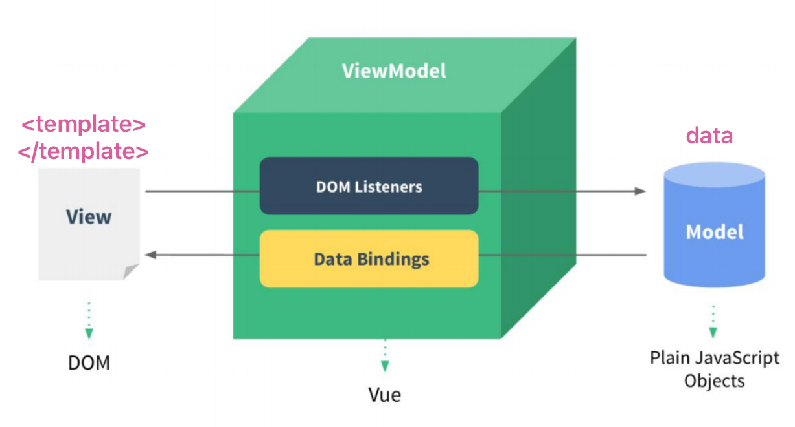
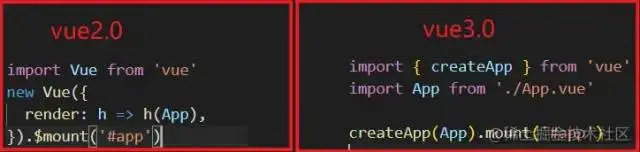

## 📒 Vue面试题合集

### - 简述MVVM

#### 1.什么是mvvm？

```markdown
模型视图双向绑定，model-view-viewmodel，也就是把`MVC`中的`Controller`演变成`ViewModel。Model`层代表数据模型，`View`代表UI组件也就是模版，`ViewModel`是`View`和`Model`层的桥梁也就是我们通常所说的vue实例，model里面存放数据
```



#### 2.mvvm的优点

```markdown
1.低耦合。view可以独立于model的变化和修改，model可以绑定在多个view上，当view变化时model不变，model变化时view也可以不变
2.可重用性高。
3.可独立开发。
4.可维护性
```

------

### - Vue底层实现原理

vue.js是采用数据劫持结合发布者-订阅者模式的方式，通过Object.defineProperty()来劫持各个属性的setter和getter，在数据变动时发布消息给订阅者，触发相应的监听回调
Vue是一个典型的MVVM框架，模型（Model）只是普通的javascript对象，修改它则试图（View）会自动更新。这种设计让状态管理变得非常简单而直观

**Observer（数据监听器）** : Observer的核心是通过Object.defineProprtty()来监听数据的变动，这个函数内部可以定义setter和getter，每当数据发生变化，就会触发setter。这时候Observer就要通知订阅者，订阅者就是Watcher

**Watcher（订阅者）** : Watcher订阅者作为Observer和Compile之间通信的桥梁，主要做的事情是：

1.  在自身实例化时往属性订阅器(dep)里面添加自己
1.  自身必须有一个update()方法
1.  待属性变动dep.notice()通知时，能调用自身的update()方法，并触发Compile中绑定的回调

**Compile（指令解析器）** : Compile主要做的事情是解析模板指令，将模板中变量替换成数据，然后初始化渲染页面视图，并将每个指令对应的节点绑定更新函数，添加鉴定数据的订阅者，一旦数据有变动，收到通知，更新试图

------

### - computed与watch

computed与watch是vue中用于响应式更新数据的方法，一般来说能用computed的也能用watch。

**computed** 它会根据响应式数据的变化自动计算出新的值，并缓存结果，只有在计算属性所依赖的响应式数据发生改变时才会重新计算。`computed` 适用于需要根据响应式数据计算得出结果的场景，例：购物车商品结算功能。 

**watch** 监听指定的响应式数据的变化，并在数据发生改变时执行指定的回调函数。`watch` 适用于需要执行一些异步或复杂操作的场景，例如监听表单输入框的变化并发送 Ajax 请求，或者监听路由变化并根据路由参数切换页面。

------

### vue2和vue3的区别

1. vue3相比vue2性能大幅提升
2. 创建实例不同，vue2是new vue，vue3是createapp.mout



1. 在源码上使用了proxy代替object.defineproperty完成响应式，proxy的优势：（1）对全对象进行监听，（2）省去了for in 闭包等内容可以提升效率（3）能够监听数组
2. vue采用选项式api而vue3采用组合式api，选项式api分割不同属性：data，methods，而组合式api使用方法来分割。
3. 生命周期钩子不同

```js
		vue2         ---------------            vue3
beforeCreate                            ->   setup()
Created                                 ->   setup()
beforeMount                             ->   onBeforeMount
mounted                                 ->   onMounted
beforeUpdate                            ->   onBeforeUpdate
updated                                 ->   onUpdated
beforeDestroyed                         ->   onBeforeUnmount
destroyed                               ->   onUnmounted
activated                               ->   onActivated
deactivated                             ->   onDeactivated
```

6. 父子传参不同

   vue2中直接在标签体内传递在子组件props接收即可，vue3中props和context集成进setup中了，如果使用setup语法糖还可以使用defineprops

------

#### - vuex数据持久化

前端在使用vuex存储数据的时候，一旦页面刷新，存放在内存中的数据就会被释放，vuex中常用的数据持久化的方法：

（1）利用浏览器的本地存储localStorage和sessionStorage：

- vuex的state在localStorage或sessionStorage取值

- 在mutations里面，定义的方法对vuex的状态操作的同时，对存储也做对应的操作

（2）利用vue-persistedstate插件，在store下的index.js中引入createPersistedState，然后使用插件plugins

------

### Vue Router 相关

#### $route 和 $router 对象有什么区别？

在 Vue.js 中，$route 和 $router 都是 Vue Router 提供的对象，但它们的作用不同。

`$route` 对象代表着当前激活的路由信息，它包含了当前 URL 解析得到的信息，如当前路径、参数、查询参数等。$route 对象是一个只读对象，我们无法通过改变 `$route` 对象来改变当前路由。

`$router` 对象则是 Vue Router 的实例对象，它负责管理整个路由的状态，包括当前路径、路由参数、路由切换等。`$router` 对象可以通过编程的方式来改变当前路由，如通过 `$router.push()、$router.replace()、$router.go()` 等方法。

总的来说，`$route` 对象是获取当前路由信息的方式，`$router` 对象则是控制当前路由状态的方式。

#### 什么是前端路由？什么时候适合使用前端路由？它有哪些优点和缺点？

前端路由是指在前端页面内部实现页面之间的跳转，而不是像传统的网页跳转那样在后端进行页面跳转。前端路由使用浏览器的 `history` 接口，通过改变浏览器的 URL，来更新页面的视图。

前端路由适合用于单页面应用（SPA）的开发。当一个应用中需要经常切换页面时，使用前端路由可以避免频繁向服务器发起请求，提高页面切换的速度和用户体验。

前端路由的**优点**：

- 单页面应用的页面跳转速度快，用户体验好
- 可以根据不同的 URL 显示不同的页面内容，可以更好地实现前端的页面控制
- 可以更好地实现前端路由权限控制

前端路由的**缺点**：

- 不支持搜索引擎爬虫，对于 SEO 不利
- 对于复杂的页面控制逻辑和状态管理，需要额外的工作
- 需要注意浏览器的前进后退等操作对页面的影响

总的来说，前端路由适用于对页面跳转速度和用户体验有要求的单页面应用，但在一些场景下，需要权衡其带来的一些缺点。

#### Vue Router 路由有哪些模式？各模式有什么区别？

Vue Router 路由有三种模式：hash 模式、history 模式和 abstract 模式。

| 区别         | hash模式                                               | history模式                                                  | abstract模式                                           |
| ------------ | ------------------------------------------------------ | ------------------------------------------------------------ | ------------------------------------------------------ |
| URL 格式     | URL 中带有 #，如：`http://example.com/#/home`          | URL 中没有 #，而是直接使用 path， 如：`http://example.com/home` | 没有真实的 URL，只使用虚拟路径，如：`/home`            |
| 浏览器兼容性 | 兼容性好，支持所有浏览器                               | 需要 HTML5 支持，不支持 IE9 及以下版本                       | 无浏览器兼容问题                                       |
| 服务端配置   | 不需要进行额外配置，可以直接在前端中使用               | 需要服务器端进行配置，防止 404                               | 不需要服务端配置                                       |
| SEO          | 不利于 SEO，因为搜索引擎不会爬取 URL 中的 # 后面的内容 | 对 SEO 更加友好，因为路径更加规范                            | 不利于 SEO                                             |
| 使用场景     | 不需要考虑浏览器兼容性和服务端配置，适用于简单应用场景 | 需要考虑 SEO 和更规范的 URL 地址，适用于较复杂应用场景       | 非浏览器环境下的应用程序或者只需要使用编程式导航的情况 |

一般情况下，我们建议使用 history 模式，因为它对 SEO 更加友好、URL 更加规范，并且随着 HTML5 技术的普及，浏览器兼容性也不再是问题。但是在特定场景下，如需要支持 IE9 及以下浏览器，或者不方便进行服务端配置时，可以选择使用 hash 模式。而 abstract 模式则适用于一些特殊的场景，如非浏览器环境下的应用程序或者只需要使用编程式导航的情况。

#### 【mt1】Vue懒加载

##### 1. 懒加载定义

路由懒加载是指：指的是打包部署时将资源按照对应的页面进行划分，需要的时候加载对应的页面资源，而不是把所有的页面资源打包部署到一块。避免不必要资源加载。

##### 2. 懒加载作用

像vue这种单页面应用，如果没有应用懒加载，运用webpack打包后的文件将会异常的大，造成进入首页时，需要加载的内容过多，时间过长，会出啊先长时间的白屏，即使做了loading也是不利于用户体验，而运用懒加载则可以将页面进行划分，需要的时候加载页面，可以有效的分担首页所承担的加载压力，减少首页加载用时

```js
/// 懒加载1
    {
      path: "/home",
      component: () => import("@/components/Home"), // 懒加载不用在一开始import组件了
    }
```

```js
/// 懒加载2
    {
      path: "/home",
      component: (resolve) => require(["@/components/Home"], resolve),
    }
```

------

### nextTick

#### nextTick的实现

1.  `nextTick`是`Vue`提供的一个全局`API`,是在下次`DOM`更新循环结束之后执行延迟回调，在修改数据之后使用`$nextTick`，则可以在回调中获取更新后的`DOM`；
1.  Vue在更新DOM时是异步执行的。只要侦听到数据变化，`Vue`将开启1个队列，并缓冲在同一事件循环中发生的所有数据变更。如果同一个`watcher`被多次触发，只会被推入到队列中-次。这种在缓冲时去除重复数据对于避免不必要的计算和`DOM`操作是非常重要的。`nextTick`方法会在队列中加入一个回调函数，确保该函数在前面的dom操作完成后才调用；
1.  比如，我在干什么的时候就会使用nextTick，传一个回调函数进去，在里面执行dom操作即可；
1.  我也有简单了解`nextTick`实现，它会在`callbacks`里面加入我们传入的函数，然后用`timerFunc`异步方式调用它们，首选的异步方式会是`Promise`。这让我明白了为什么可以在`nextTick`中看到`dom`操作结果。

#### nextTick的实现原理是什么？

在下次 DOM 更新循环结束之后执行延迟回调，在修改数据之后立即使用 nextTick 来获取更新后的 DOM。 nextTick主要使用了宏任务和微任务。 根据执行环境分别尝试采用Promise、MutationObserver、setImmediate，如果以上都不行则采用setTimeout定义了一个异步方法，多次调用nextTick会将方法存入队列中，通过这个异步方法清空当前队列。

------

### keep-alive

#### keep-alive的实现

keep-alive是Vue.js的一个内置组件。它能够不活动的组件实例保存在内存中，而不是直接将其销毁，它是一个抽象组件，不会被渲染到真实DOM中，也不会出现在父组件链中。

作用：实现组件缓存，保持这些组件的状态，以避免反复渲染导致的性能问题。 需要缓存组件 频繁切换，不需要重复渲染

场景：tabs标签页 后台导航，vue性能优化

原理：`Vue.js`内部将`DOM`节点抽象成了一个个的`VNode`节点，`keep-alive`组件的缓存也是基于`VNode`节点的而不是直接存储`DOM`结构。它将满足条件`（pruneCache与pruneCache）`的组件在`cache`对象中缓存起来，在需要重新渲染的时候再将`vnode`节点从`cache`对象中取出并渲染。

### keep-alive 的属性

它提供了include与exclude两个属性，允许组件有条件地进行缓存。

include定义缓存白名单，keep-alive会缓存命中的组件；exclude定义缓存黑名单，被命中的组件将不会被缓存；max定义缓存组件上限，超出上限使用LRU的策略置换缓存数据。

在动态组件中的应用

```js
<keep-alive :include="whiteList" :exclude="blackList" :max="amount">
     <component :is="currentComponent"></component>
</keep-alive>
```

在vue-router中的应用

```js
<keep-alive :include="whiteList" :exclude="blackList" :max="amount">
    <router-view></router-view>
</keep-alive>
```

vue 中完整示例

```
<keep-alive>
    <coma v-if="test"></coma>
    <comb v-else="test"></comb>
</keep-alive>
<button @click="test=handleClick">请点击</button>

export default {
    data () {
        return {
            test: true
        }
    },
    methods: {
        handleClick () {
            this.test = !this.test;
        }
    }
}
```

------

### Vue中的diff算法

**Vue 中的 diff 算法是用于更新 Virtual DOM 树，从而实现高效的 DOM 操作。diff 算法会对比新旧两棵 Virtual DOM 树的差异，然后只更新必要的部分，从而减少 DOM 操作的次数。Vue 中的 diff 算法包括以下几个步骤：**

1. 新旧节点的比较 diff 算法会首先比较新旧节点是否相同，如果相同，则继续比较子节点；如果不同，则进行下一步操作。

2. 对子节点进行比较 对新旧节点的子节点进行比较，具体分为以下四种情况：

3. - 新节点没有子节点，旧节点有子节点：直接删除旧节点的子节点
   - 旧节点没有子节点，新节点有子节点：直接添加新节点的子节点
   - 新旧节点都有子节点：继续比较子节点
   - 新旧节点都有相同的子节点：对相同的子节点进行递归比较

4. 对旧节点多余的子节点进行删除 如果旧节点的子节点比新节点的子节点多，那么对于多余的子节点，直接进行删除。

在 diff 算法中，由于只更新必要的部分，所以可以大大提高 DOM 操作的效率。这也是 Vue 可以实现高效渲染的重要原因之一。

------

### Vue 模板是如何编译的？经历了哪些过程？

**Vue 模板编译是指将 Vue 模板字符串转换为可执行的渲染函数的过程。**

Vue 模板编译的过程主要分为以下三个步骤：

1. 解析模板：Vue 会使用正则表达式解析模板字符串，解析出其中的指令、标签、属性等内容。
2. 生成 AST（抽象语法树）：将解析后的模板字符串转化为抽象语法树，抽象语法树是一个以 JavaScript 对象表示的树形结构，它将模板中的各个节点和属性用 JavaScript 对象的形式表示出来，方便后续对模板进行分析和处理。
3. 生成渲染函数：将 AST 转化为渲染函数，渲染函数是一个纯 JavaScript 函数，用于将模板转化为 Virtual DOM。
