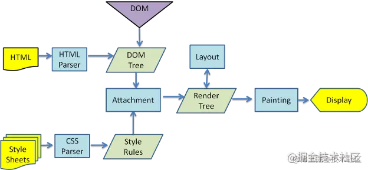
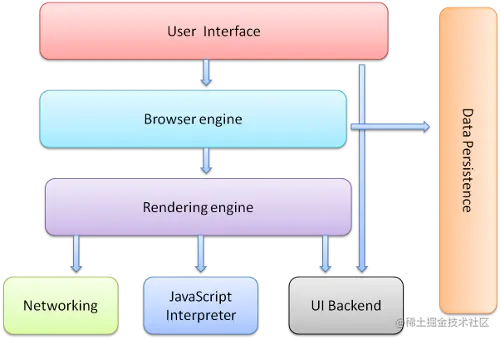
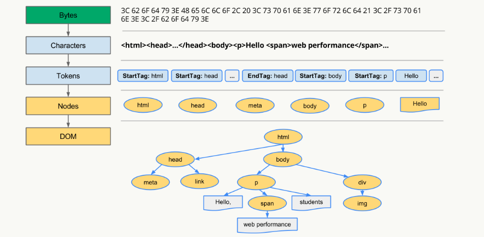

## 📒 浏览器面试题合集

### - Cookie、sessionStorage、localStorage 的区别

#### 相同点

```markdown
存储在客户端
```

#### 不同点

```markdown
(1)大小：cookie一般不超过4kb，localStorage和sessionStorage比cookie大得多一般在5mb左右
(2)有效期：cookie在设置的过期时间之前均有效，localStorage永久有效，sessionStorage临时有效在当前浏览器关闭后自动删除
(3)cookie会跟随请求自动发送至服务器，localStorage和sessionStorage数据保存在本地
```

------

### - 什么是重绘和回流？有什么区别？如何触发？如何避免？

#### 1.概念

- 重绘：元素的外观发生变化，但不影响布局
- 回流：元素的位置，布局，尺寸发生变化，具体表现为重新生成布局，重新排列元素

#### 2.区别

回流必定导致重绘，重绘不一定导致回流

#### 3.如何触发？

##### 3.1 回流

1. 删除dom
2. 元素尺寸发生变化，如宽度，高度，填充，边框
3. 页面布局发生变化
4. css中伪类激活如：hover

##### 3.2 重绘

元素的颜色，边框，背景等样式发生变化，但不一定影响元素布局发生变化

#### 4.如何避免？

- 避免频繁操作样式。多次修改时，可以通过一个class来修改
- 避免逐项修改样式。
- 使用文档片段或者offscreen来进行批量修改
- 避免使用table。table中元素发生回流会影响整个表格发生回流
- 复杂动画的元素使用绝对定位
- 避免频繁访问布局信息如offsetwidth，offsetheight，访问前先缓存。

**回流和重绘对性能影响较大，尤其是在移动设备上。因此，优化代码以减少回流和重绘次数是提高网页性能的重要手段。**

------

### 从输入URL到页面加载的全过程 ‼️

```markdown
总结：
输入URL---查找缓存---DNS域名解析，解析URL中IP地址---建立TCP链接---发送HTTP请求---服务器收到请求并返回HTTP响应---释放TCP链接---客户端解析HTML内容---JS引擎解析JS代码
```

1. 首先在浏览器中输入URL

1. 查找缓存：浏览器先查看浏览器缓存-系统缓存-路由缓存中是否有该地址页面，如果有则显示页面内容。如果没有则进行下一步。

   -   浏览器缓存：浏览器会记录DNS一段时间，因此，只是第一个地方解析DNS请求；
   -   操作系统缓存:如果在浏览器缓存中不包含这个记录，则会使系统调用操作系统， 获取操作系统的记录(保存最近的DNS查询缓存)；
   -   路由器缓存：如果上述两个步骤均不能成功获取DNS记录，继续搜索路由器缓存；
   -   ISP缓存：若上述均失败，继续向ISP搜索。

1. DNS域名解析：浏览器向DNS服务器发起请求，解析该URL中的域名对应的IP地址。`DNS服务器是基于UDP的，因此会用到UDP协议`。

1. 建立TCP连接：解析出IP地址后，根据IP地址和默认80端口，和服务器建立TCP连接

1. 发起HTTP请求：浏览器发起读取文件的HTTP请求，该请求报文作为TCP三次握手的第三次数据发送给服务器

1. 服务器响应请求并返回结果：服务器对浏览器请求做出响应，并把对应的html文件发送给浏览器

1. 关闭TCP连接：通过四次挥手释放TCP连接

1. 浏览器渲染：客户端（浏览器）解析HTML内容并渲染出来，浏览器接收到数据包后的解析流程为：

   -   构建DOM树：词法分析然后解析成DOM树（dom tree），是由dom元素及属性节点组成，树的根是document对象
   -   构建CSS规则树：生成CSS规则树（CSS Rule Tree）
   -   构建render树：Web浏览器将DOM和CSSOM结合，并构建出渲染树（render tree）
   -   布局（Layout）：计算出每个节点在屏幕中的位置
   -   绘制（Painting）：即遍历render树，并使用UI后端层绘制每个节点。

   - 回流重绘
     - 回流必将引起重绘，重绘不一定引起回流

1. JS引擎解析过程：调用JS引擎执行JS代码（JS的解释阶段，预处理阶段，执行阶段生成执行上下文，VO，作用域链、回收机制等等）

   -   创建window对象：window对象也叫全局执行环境，当页面产生时就被创建，所有的全局变量和函数都属于window的属性和方法，而DOM Tree也会映射在window的doucment对象上。当关闭网页或者关闭浏览器时，全局执行环境会被销毁。
   -   加载文件：完成js引擎分析它的语法与词法是否合法，如果合法进入预编译
   -   预编译：在预编译的过程中，浏览器会寻找全局变量声明，把它作为window的属性加入到window对象中，并给变量赋值为'undefined'；寻找全局函数声明，把它作为window的方法加入到window对象中，并将函数体赋值给他（匿名函数是不参与预编译的，因为它是变量）。而变量提升作为不合理的地方在ES6中已经解决了，函数提升还存在。
   -   解释执行：执行到变量就赋值，如果变量没有被定义，也就没有被预编译直接赋值，在ES5非严格模式下这个变量会成为window的一个属性，也就是成为全局变量。string、int这样的值就是直接把值放在变量的存储空间里，object对象就是把指针指向变量的存储空间。函数执行，就将函数的环境推入一个环境的栈中，执行完成后再弹出，控制权交还给之前的环境。JS作用域其实就是这样的执行流机制实现的。

------

### DNS 预解析是什么？怎么实现？

1.DNS预解析（DNS prefetching）：在网页加载时，提前获取网页中需要引用外部资源的DNS解析结果，做到在浏览器发送请求时直接获取已经解析好的IP地址，加快网页的加载速度。

DNS预解析可以通过以下两种方式实现：

1、HTML标签方式： 在网页head标签内，使用标签指定需要预解析的DNS域名：

```html
<head>
    <link rel="dns-prefetch" href="//example.com">
</head>
```

这样浏览器在解析HTML时，就会提前进行DNS解析，减少后续请求时的解析时间。

2、JavaScript方式： 在网页中使用JavaScript代码实现DNS预解析：

```js
<script>
    var dns = new Image();
    dns.src = "//example.com";
</script>
```

该代码会创建一个Image对象，使用其src属性指定需要预解析的域名。这样在网页加载时，浏览器就会提前解析该域名的DNS，加快后续请求的速度。

需要注意的是，DNS预解析虽然可以提高网页加载速度，但过多的DNS预解析可能会增加网络流量，甚至会对服务器造成压力。因此，应该根据网页实际情况进行适当的DNS预解析。

------

### 浏览器的功能

向服务器发送网络请求，在浏览器窗口中展示网络请求的结果。

------

### 浏览器的工作原理

渲染引擎一开始会从网络层获取请求文档的内容，内容的大小一般限制在 8000 个块以内。

然后进行如下所示的基本流程：


图：渲染引擎的基本流程。

渲染引擎将开始`解析 HTML 文档`，并将各标记逐个转化成“内容树”上的 [DOM](https://link.juejin.cn?target=https%3A%2F%2Fwww.html5rocks.com%2Fzh%2Ftutorials%2Finternals%2Fhowbrowserswork%2F%23DOM "https://www.html5rocks.com/zh/tutorials/internals/howbrowserswork/#DOM") 节点。同时也会`解析外部 CSS 文件以及样式元素中的样式数据`。HTML 中这些带有视觉指令的样式信息将用于创建另一个树结构：[`渲染树`](https://link.juejin.cn?target=https%3A%2F%2Fwww.html5rocks.com%2Fzh%2Ftutorials%2Finternals%2Fhowbrowserswork%2F%23Render_tree_construction "https://www.html5rocks.com/zh/tutorials/internals/howbrowserswork/#Render_tree_construction")。

渲染树包含多个带有视觉属性（如颜色和尺寸）的矩形。这些矩形的排列顺序就是它们将在屏幕上显示的顺序。

渲染树构建完毕之后，进入“[布局](https://link.juejin.cn?target=https%3A%2F%2Fwww.html5rocks.com%2Fzh%2Ftutorials%2Finternals%2Fhowbrowserswork%2F%23layout "https://www.html5rocks.com/zh/tutorials/internals/howbrowserswork/#layout")”处理阶段，也就是为每个节点分配一个应出现在屏幕上的确切坐标。

下一个阶段是[绘制](https://link.juejin.cn?target=https%3A%2F%2Fwww.html5rocks.com%2Fzh%2Ftutorials%2Finternals%2Fhowbrowserswork%2F%23Painting "https://www.html5rocks.com/zh/tutorials/internals/howbrowserswork/#Painting") - 渲染引擎会遍历渲染树，由用户界面后端层将每个节点绘制出来。

需要着重指出的是，这是一个渐进的过程。为达到更好的用户体验，渲染引擎会力求尽快将内容显示在屏幕上。它不必等到整个 HTML 文档解析完毕之后，就会开始构建呈现树和设置布局。在不断接收和处理来自网络的其余内容的同时，渲染引擎会将部分内容解析并显示出来。

------

### 浏览器是如何渲染UI的？

1.  浏览器获取HTML文件，然后对文件进行解析，形成DOM Tree
1.  与此同时，进行CSS解析，生成Style Rules
1.  接着将DOM Tree与Style Rules合成为 Render Tree
1.  接着进入布局（Layout）阶段，也就是为每个节点分配一个应出现在屏幕上的确切坐标
1.  随后调用GPU进行绘制（Paint），遍历Render Tree的节点，并将元素呈现出来




------

### 浏览器的主要组成部分是什么？

1.  **用户界面** - 包括地址栏、前进/后退按钮、书签菜单等。除了浏览器主窗口显示的您请求的页面外，其他显示的各个部分都属于用户界面。
1.  **浏览器引擎** - 在用户界面和呈现引擎之间传送指令。
1.  **呈现引擎** - 负责显示请求的内容。如果请求的内容是 HTML，它就负责解析 HTML 和 CSS 内容，并将解析后的内容显示在屏幕上。
1.  **网络** - 用于网络调用，比如 HTTP 请求。其接口与平台无关，并为所有平台提供底层实现。
1.  **用户界面后端** - 用于绘制基本的窗口小部件，比如组合框和窗口。其公开了与平台无关的通用接口，而在底层使用操作系统的用户界面方法。
1.  **JavaScript 解释器**。用于解析和执行 JavaScript 代码。
1.  **数据存储**。这是持久层。浏览器需要在硬盘上保存各种数据，例如 Cookie。新的 HTML 规范 (HTML5) 定义了“网络数据库”，这是一个完整（但是轻便）的浏览器内数据库。
    

​                                       图：浏览器的主要组件。

值得注意的是，和大多数浏览器不同，Chrome 浏览器的每个标签页都分别对应一个呈现引擎实例。每个标签页都是一个独立的进程。

------

### DOM Tree是如何构建的？

1.  转码: 浏览器将接收到的二进制数据按照指定编码格式转化为HTML字符串
1.  生成Tokens: 之后开始parser，浏览器会将HTML字符串解析成Tokens
1.  构建Nodes: 对Node添加特定的属性，通过指针确定 Node 的父、子、兄弟关系和所属 treeScope
1.  生成DOM Tree: 通过node包含的指针确定的关系构建出DOM\Tree


